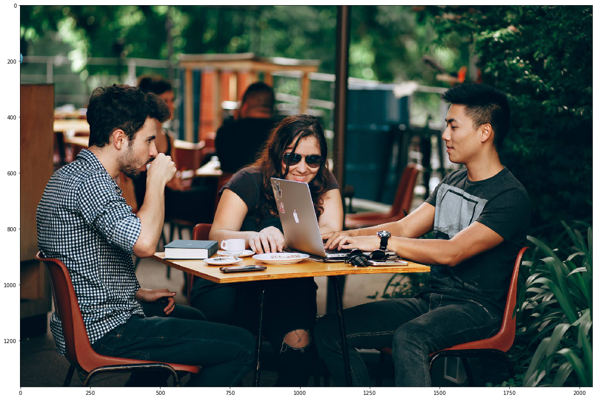
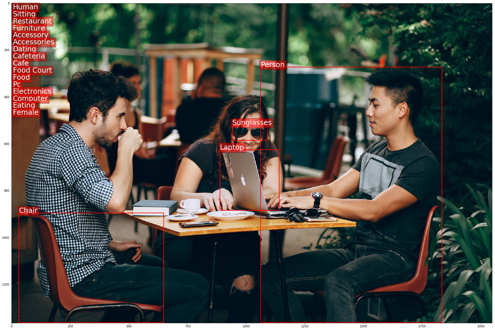
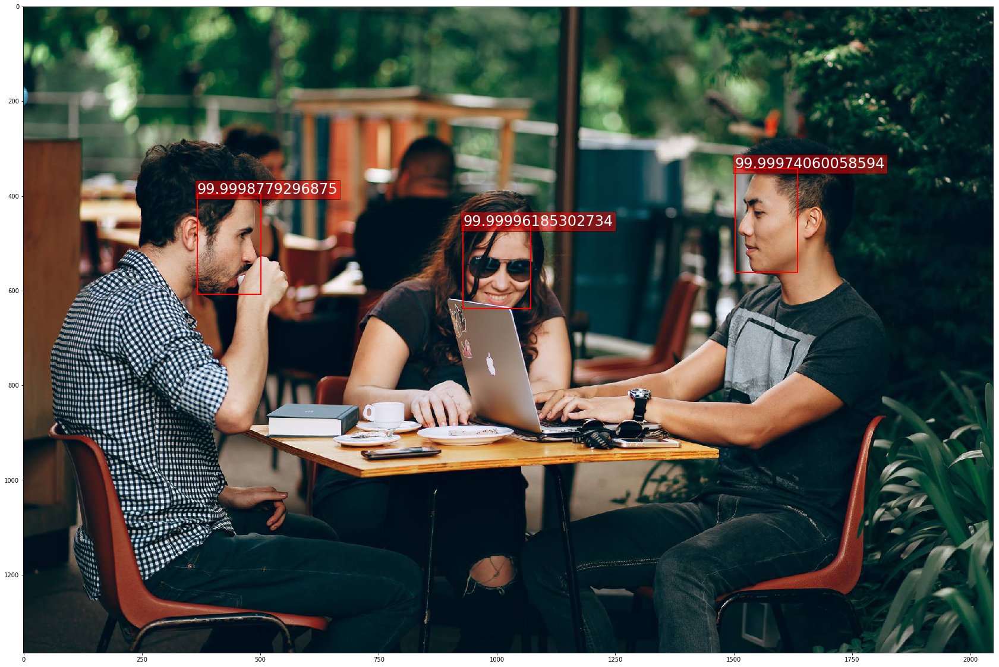

+++
title =  "Amazon Rekognition Service"
date = 2019-02-27T22:40:19-05:00
tags = []
featured_image = ""
description = ""
+++

This is an overview of using the AWS Rekognition Service. As a starting point, we will use an image as a basis to work with. The Rekognition service can work with either images from an S3 bucket or from a stream of bytes. Here is a plot of the image that we are using:

<!--more-->

# Notebooks

View the IPython notebook for this session on Github [here](https://github.com/HSV-AI/presentations/blob/master/2019/190227/Amazon_Rekognition.ipynb)

Or launch the notebook in Google Colab or MyBinder:

[](https://colab.research.google.com/github/HSV-AI/presentations/blob/master/2019/190227/Amazon_Rekognition.ipynb)


[](https://mybinder.org/v2/gh/HSV-AI/presentations/master?filepath=2019/190227/Amazon_Rekognition.ipynb)

#Code 

```python
%matplotlib inline
import matplotlib.pyplot as plt
import matplotlib.image as mpimg
import matplotlib.patches as patches

imageFile='data/cafe.jpg'
img=mpimg.imread(imageFile)

plt.figure(figsize=(20, 16))
plt.imshow(img)
plt.show()
```





# Python AWS SDK - Boto3

[Anaconda Install](https://anaconda.org/anaconda/boto3) - How to install Boto3 using Anaconda.

[Boto3 Quickstart](https://boto3.amazonaws.com/v1/documentation/api/latest/guide/quickstart.html) - This is a good quick start tutorial to get you going with boto3 and verify that it's working properly.

[AWS Rekognition Pricing](https://aws.amazon.com/rekognition/pricing/) - Currently (2/27/2018) the price is $1.00 / 1000 images. Check the link to see updated pricing information.

[Tutorial Basis](https://docs.aws.amazon.com/rekognition/latest/dg/images-bytes.html) - This is the code for the basis of this presentation.


```python
import boto3
client=boto3.client('rekognition')
```


```python
with open(imageFile, 'rb') as image:
    %time response = client.detect_labels(Image={'Bytes': image.read()})
        
print('Detected labels in ' + imageFile + ':\n')
for label in response['Labels']:
    print (label['Name'] + ' : ' + str(label['Confidence']))

print('\nDone...')

```

    CPU times: user 20.9 ms, sys: 8.56 ms, total: 29.4 ms
    Wall time: 799 ms
    Detected labels in data/cafe.jpg:
    
    Person : 99.89877319335938
    Human : 99.89877319335938
    Sitting : 99.89877319335938
    Restaurant : 99.72095489501953
    Chair : 99.66412353515625
    Furniture : 99.66412353515625
    Sunglasses : 97.66460418701172
    Accessory : 97.66460418701172
    Accessories : 97.66460418701172
    Dating : 95.6298599243164
    Cafeteria : 92.8125228881836
    Cafe : 92.75373077392578
    Food Court : 86.69856262207031
    Food : 86.69856262207031
    Pc : 77.42462158203125
    Electronics : 77.42462158203125
    Laptop : 77.42462158203125
    Computer : 77.42462158203125
    Eating : 58.370609283447266
    Female : 55.515804290771484
    
    Done...


# Object Detection

Now that we have the labels returned by the service, let's plot the bounding box for each label. Some labels apply to the entire image and will not have a bounding box.


```python
# Create figure and axes
fig,ax = plt.subplots(1, figsize=(30, 20))

# Display the image
ax.imshow(img)
height = img.shape[0]
width = img.shape[1]

top=26
for label in response['Labels']:
    if len(label['Instances']) > 0:
        box = label['Instances'][0]['BoundingBox']
        plt.text(box['Left']*width, box['Top']*height, label['Name'], color='white', 
                 fontsize=24, bbox=dict(facecolor='red', alpha=0.5))
        rect = patches.Rectangle((box['Left']*width, box['Top']*height),
                                 box['Width']*width,box['Height']*height,
                                 linewidth=2,edgecolor='r',facecolor='none')
        # Add the patch to the Axes
        ax.add_patch(rect)
    else:
        plt.text(5, top, label['Name'], color='white', 
                 fontsize=24, bbox=dict(facecolor='red', alpha=0.5))
        top = top + 30
        
plt.show()
```





# Fun with Face Detection

Now that we have the label detection working, let's take a look at the face detection method of the service.


```python
with open(imageFile, 'rb') as image:
    %time response = client.detect_faces(Image={'Bytes': image.read()})
        
# Create figure and axes
fig,ax = plt.subplots(1, figsize=(30, 20))

# Display the image
ax.imshow(img)
height = img.shape[0]
width = img.shape[1]

top=26
for label in response['FaceDetails']:
    box = label['BoundingBox']
    plt.text(box['Left']*width, box['Top']*height, label['Confidence'], color='white', 
         fontsize=24, bbox=dict(facecolor='red', alpha=0.5))

    rect = patches.Rectangle((box['Left']*width, box['Top']*height),
                             box['Width']*width,box['Height']*height,
                             linewidth=2,edgecolor='r',facecolor='none')
    # Add the patch to the Axes
    ax.add_patch(rect)
        
plt.show()
```

    CPU times: user 32.8 ms, sys: 124 µs, total: 33 ms
    Wall time: 3.19 s




