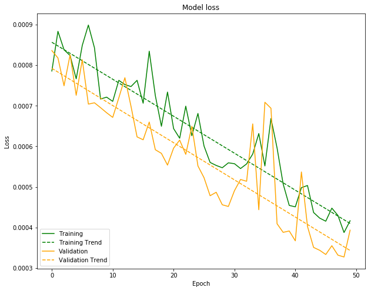

+++
title =  "Recurrent Neural Networks Part 3"
date = 2019-06-26T22:40:19-05:00
tags = []
featured_image = ""
description = ""
+++

This week we will be covering the final part of RNN development to predict stock price information using previous values.

This notebook is based on a tutorial: "Multivariate Time Series using RNN with Keras" from [here](https://medium.com/datadriveninvestor/multivariate-time-series-using-rnn-with-keras-7f78f4488679). We have modified the approach to use all available values as input instead of averaging the low and high price.

<!--more-->

View the IPython notebook for this session on Github [here](https://github.com/HSV-AI/presentations/blob/master//2019/190626_RNN_TimeSeries_Part3.ipynb

Or launch the notebook in Google Colab or MyBinder:

[](https://colab.research.google.com/github/HSV-AI/presentations/blob/master/2019/190626_RNN_TimeSeries_Part3.ipynb)


[](https://mybinder.org/v2/gh/HSV-AI/presentations/master?filepath=2019/190626_RNN_TimeSeries_Part3.ipynb)


## Meeting Agenda


1. Introduction
2. Project Updates
3. RNN Code Walkthrough
4. AI Model Deployment


## RNN Example Code


```python
import numpy as np
import pandas as pd
import math
from keras import Sequential
from keras.layers import Dense, LSTM
from sklearn.preprocessing import MinMaxScaler
import matplotlib.pyplot as plt
%matplotlib inline

from sklearn.model_selection import train_test_split
total_training = []
total_validation = []


```

First, we download a csv export of the Google stock from [here](https://www.nasdaq.com/symbol/goog/historical).

For convenience, this is saved in the presentations repository and can be access by URL.

**Note:** 

We need to use the thousands=',' parameter in order to ignore the commas in the numbers when converting to floats.

We'll use the head() method to get a look at what the dataframe looks like.


```python
fileURL = "https://github.com/HSV-AI/presentations/raw/master/2019/190619/HistoricalQuotes.csv"
stock_data = pd.read_csv(fileURL, thousands=',')
stock_data.head(5)
```


<div>
<style scoped>
    .dataframe tbody tr th:only-of-type {
        vertical-align: middle;
    }

    .dataframe tbody tr th {
        vertical-align: top;
    }

    .dataframe thead th {
        text-align: right;
    }
</style>
<table border="1" class="dataframe">
  <thead>
    <tr style="text-align: right;">
      <th></th>
      <th>date</th>
      <th>close</th>
      <th>volume</th>
      <th>open</th>
      <th>high</th>
      <th>low</th>
    </tr>
  </thead>
  <tbody>
    <tr>
      <th>0</th>
      <td>16:00</td>
      <td>1103.60</td>
      <td>1386584.0</td>
      <td>1107.82</td>
      <td>1116.39</td>
      <td>1098.9900</td>
    </tr>
    <tr>
      <th>1</th>
      <td>2019/06/18</td>
      <td>1103.60</td>
      <td>1386684.0</td>
      <td>1109.69</td>
      <td>1116.39</td>
      <td>1098.9900</td>
    </tr>
    <tr>
      <th>2</th>
      <td>2019/06/17</td>
      <td>1092.50</td>
      <td>941602.0</td>
      <td>1086.28</td>
      <td>1099.18</td>
      <td>1086.2800</td>
    </tr>
    <tr>
      <th>3</th>
      <td>2019/06/14</td>
      <td>1085.35</td>
      <td>1111643.0</td>
      <td>1086.42</td>
      <td>1092.69</td>
      <td>1080.1721</td>
    </tr>
    <tr>
      <th>4</th>
      <td>2019/06/13</td>
      <td>1088.77</td>
      <td>1058000.0</td>
      <td>1083.64</td>
      <td>1094.17</td>
      <td>1080.1500</td>
    </tr>
  </tbody>
</table>
</div>


```python
stock_data.info()
```

    <class 'pandas.core.frame.DataFrame'>
    RangeIndex: 1260 entries, 0 to 1259
    Data columns (total 6 columns):
    date      1260 non-null object
    close     1260 non-null float64
    volume    1260 non-null float64
    open      1260 non-null float64
    high      1260 non-null float64
    low       1260 non-null float64
    dtypes: float64(5), object(1)
    memory usage: 59.1+ KB


The example showed how to use 2 values as input - the volume and an average of the high/low price. I've changed this to just use the 5 values individually and let the network figure out how they might be related when predicting an output.


```python
input_feature= stock_data.iloc[:,1:].values
input_data = input_feature
input_feature.shape

output_feature = stock_data.iloc[:,[1,3]].values

print(input_feature.shape)
print(output_feature.shape)
stock_data.iloc[:,1:].head(5)
```

    (1260, 5)
    (1260, 2)


<div>
<style scoped>
    .dataframe tbody tr th:only-of-type {
        vertical-align: middle;
    }

    .dataframe tbody tr th {
        vertical-align: top;
    }

    .dataframe thead th {
        text-align: right;
    }
</style>
<table border="1" class="dataframe">
  <thead>
    <tr style="text-align: right;">
      <th></th>
      <th>close</th>
      <th>volume</th>
      <th>open</th>
      <th>high</th>
      <th>low</th>
    </tr>
  </thead>
  <tbody>
    <tr>
      <th>0</th>
      <td>1103.60</td>
      <td>1386584.0</td>
      <td>1107.82</td>
      <td>1116.39</td>
      <td>1098.9900</td>
    </tr>
    <tr>
      <th>1</th>
      <td>1103.60</td>
      <td>1386684.0</td>
      <td>1109.69</td>
      <td>1116.39</td>
      <td>1098.9900</td>
    </tr>
    <tr>
      <th>2</th>
      <td>1092.50</td>
      <td>941602.0</td>
      <td>1086.28</td>
      <td>1099.18</td>
      <td>1086.2800</td>
    </tr>
    <tr>
      <th>3</th>
      <td>1085.35</td>
      <td>1111643.0</td>
      <td>1086.42</td>
      <td>1092.69</td>
      <td>1080.1721</td>
    </tr>
    <tr>
      <th>4</th>
      <td>1088.77</td>
      <td>1058000.0</td>
      <td>1083.64</td>
      <td>1094.17</td>
      <td>1080.1500</td>
    </tr>
  </tbody>
</table>
</div>


```python
plt.figure(figsize=(10,8))
plt.plot(input_feature[:,1])
plt.title("Volume of stocks sold")
plt.xlabel("Time (latest-> oldest)")
plt.ylabel("Volume of stocks traded")
plt.show()
```


```python
plt.figure(figsize=(10,8))
plt.plot(input_feature[:,2], color='blue')
plt.title("Google Stock Prices")
plt.xlabel("Time (latest-> oldest)")
plt.ylabel("Stock Open Price")
plt.show()
```


```python
input_scaler = MinMaxScaler(feature_range=(0,1))
input_data[:,:] = input_scaler.fit_transform(input_feature[:,:])

output_scaler = MinMaxScaler(feature_range=(0,1))
# output_feature = output_feature.reshape(-1, 1)
output_data = output_scaler.fit_transform(output_feature[:,:])
```


```python
lookback= 50

X=[]
y=[]
for i in range(len(stock_data)-lookback-1):
    t=[]
    for j in range(0,lookback):
        t.append(input_data[[(i+j)], :])

    X.append(t)
    y.append(output_data[i+ lookback])
```


```python
X, y= np.array(X), np.array(y)
X = X.reshape(X.shape[0],lookback, 5)

print(X.shape)
print(y.shape)
```

    (1209, 50, 5)
    (1209, 2)


```python
model = Sequential()
model.add(LSTM(units=30, return_sequences= True, input_shape=(X.shape[1],5)))
model.add(LSTM(units=30, return_sequences=True))
model.add(LSTM(units=30))
model.add(Dense(units=2))
model.summary()

```

    _________________________________________________________________
    Layer (type)                 Output Shape              Param #   
    =================================================================
    lstm_4 (LSTM)                (None, 50, 30)            4320      
    _________________________________________________________________
    lstm_5 (LSTM)                (None, 50, 30)            7320      
    _________________________________________________________________
    lstm_6 (LSTM)                (None, 30)                7320      
    _________________________________________________________________
    dense_2 (Dense)              (None, 2)                 62        
    =================================================================
    Total params: 19,022
    Trainable params: 19,022
    Non-trainable params: 0
    _________________________________________________________________


```python
model.compile(optimizer='adam', loss='mean_squared_error')
```

    W0626 22:12:08.926577 140698563360640 deprecation_wrapper.py:119] From /usr/local/lib/python3.6/dist-packages/keras/optimizers.py:790: The name tf.train.Optimizer is deprecated. Please use tf.compat.v1.train.Optimizer instead.
    


```python
from IPython.display import SVG
from keras.utils.vis_utils import model_to_dot

SVG(model_to_dot(model, show_shapes=True).create(prog='dot', format='svg'))
```


```python
def plot_loss(history):

  length = len(history.history['loss'])
  rng = range(length)

  training_fit = np.polyfit(rng, history.history['loss'], 1)
  training_trend = np.poly1d(training_fit)

  val_fit = np.polyfit(rng, history.history['val_loss'], 1)
  val_trend = np.poly1d(val_fit)

  plt.figure(figsize=(10,8))
  plt.plot(history.history['loss'], color='green')
  plt.plot(training_trend(rng), color='green', linestyle='--')
  plt.plot(history.history['val_loss'], color='orange')
  plt.plot(val_trend(rng), color='orange', linestyle='--')

  plt.title('Model loss')
  plt.ylabel('Loss')
  plt.xlabel('Epoch')
  plt.legend(['Training', 'Training Trend', 'Validation', 'Validation Trend'], loc='lower left')
  plt.show()

```

Originally, we had this line:

history = model.fit(X, y, validation_split=0.30, epochs=50, batch_size=32, verbose=1)

The problem is that the validation split always takes the validation off of the back of the data, instead of randomly selecting 30% for validation.

To change this up, we will use the train_test_split from sklearn to give us a random 30% validation set. Then we will train for 50 epochs and graph the training loss and validation loss to see how we're doing.

We will repeat this for a few times to see how low the error drops.


```python
for i in range(4):
  XTraining, XValidation, YTraining, YValidation = train_test_split(X,y,test_size=0.3) # before model building
  history = model.fit(XTraining, YTraining, batch_size=32, epochs=50, validation_data=(XValidation,YValidation))
  total_training.extend(history.history['loss'])
  total_validation.extend(history.history['val_loss'])
  
  # Plot training & validation loss values
  plot_loss(history)

```

    W0626 22:12:19.481230 140698563360640 deprecation.py:323] From /usr/local/lib/python3.6/dist-packages/tensorflow/python/ops/math_grad.py:1250: add_dispatch_support.<locals>.wrapper (from tensorflow.python.ops.array_ops) is deprecated and will be removed in a future version.
    Instructions for updating:
    Use tf.where in 2.0, which has the same broadcast rule as np.where
    W0626 22:12:21.329057 140698563360640 deprecation_wrapper.py:119] From /usr/local/lib/python3.6/dist-packages/keras/backend/tensorflow_backend.py:986: The name tf.assign_add is deprecated. Please use tf.compat.v1.assign_add instead.
    
    W0626 22:12:21.484905 140698563360640 deprecation_wrapper.py:119] From /usr/local/lib/python3.6/dist-packages/keras/backend/tensorflow_backend.py:973: The name tf.assign is deprecated. Please use tf.compat.v1.assign instead.
    


    Train on 846 samples, validate on 363 samples
    Epoch 1/50
    846/846 [==============================] - 5s 6ms/step - loss: 0.0493 - val_loss: 0.0074
    Epoch 2/50
    846/846 [==============================] - 2s 3ms/step - loss: 0.0036 - val_loss: 0.0018
    Epoch 3/50
    846/846 [==============================] - 2s 3ms/step - loss: 0.0019 - val_loss: 0.0015
    Epoch 4/50
    846/846 [==============================] - 2s 3ms/step - loss: 0.0017 - val_loss: 0.0015
    Epoch 5/50
    846/846 [==============================] - 2s 3ms/step - loss: 0.0017 - val_loss: 0.0014
    Epoch 6/50
    846/846 [==============================] - 2s 3ms/step - loss: 0.0016 - val_loss: 0.0013
    Epoch 7/50
    846/846 [==============================] - 2s 3ms/step - loss: 0.0016 - val_loss: 0.0017
    Epoch 8/50
    846/846 [==============================] - 2s 3ms/step - loss: 0.0017 - val_loss: 0.0018
    Epoch 9/50
    846/846 [==============================] - 2s 3ms/step - loss: 0.0015 - val_loss: 0.0013
    Epoch 10/50
    846/846 [==============================] - 2s 3ms/step - loss: 0.0015 - val_loss: 0.0013
    Epoch 11/50
    846/846 [==============================] - 2s 3ms/step - loss: 0.0015 - val_loss: 0.0012
    Epoch 12/50
    846/846 [==============================] - 2s 3ms/step - loss: 0.0014 - val_loss: 0.0013
    Epoch 13/50
    846/846 [==============================] - 2s 3ms/step - loss: 0.0014 - val_loss: 0.0011
    Epoch 14/50
    846/846 [==============================] - 2s 3ms/step - loss: 0.0014 - val_loss: 0.0011
    Epoch 15/50
    846/846 [==============================] - 2s 3ms/step - loss: 0.0014 - val_loss: 0.0012
    Epoch 16/50
    846/846 [==============================] - 2s 3ms/step - loss: 0.0013 - val_loss: 0.0012
    Epoch 17/50
    846/846 [==============================] - 2s 3ms/step - loss: 0.0013 - val_loss: 0.0010
    Epoch 18/50
    846/846 [==============================] - 2s 3ms/step - loss: 0.0012 - val_loss: 0.0010
    Epoch 19/50
    846/846 [==============================] - 2s 3ms/step - loss: 0.0014 - val_loss: 9.9284e-04
    Epoch 20/50
    846/846 [==============================] - 2s 3ms/step - loss: 0.0013 - val_loss: 9.9700e-04
    Epoch 21/50
    846/846 [==============================] - 2s 3ms/step - loss: 0.0013 - val_loss: 0.0012
    Epoch 22/50
    846/846 [==============================] - 2s 3ms/step - loss: 0.0014 - val_loss: 0.0012
    Epoch 23/50
    846/846 [==============================] - 2s 3ms/step - loss: 0.0012 - val_loss: 9.9032e-04
    Epoch 24/50
    846/846 [==============================] - 2s 3ms/step - loss: 0.0012 - val_loss: 9.3364e-04
    Epoch 25/50
    846/846 [==============================] - 2s 3ms/step - loss: 0.0011 - val_loss: 9.2768e-04
    Epoch 26/50
    846/846 [==============================] - 2s 3ms/step - loss: 0.0012 - val_loss: 9.4095e-04
    Epoch 27/50
    846/846 [==============================] - 2s 3ms/step - loss: 0.0011 - val_loss: 9.4460e-04
    Epoch 28/50
    846/846 [==============================] - 2s 3ms/step - loss: 0.0011 - val_loss: 0.0010
    Epoch 29/50
    846/846 [==============================] - 2s 3ms/step - loss: 0.0012 - val_loss: 9.3908e-04
    Epoch 30/50
    846/846 [==============================] - 2s 3ms/step - loss: 0.0013 - val_loss: 9.7271e-04
    Epoch 31/50
    846/846 [==============================] - 2s 3ms/step - loss: 0.0012 - val_loss: 9.4462e-04
    Epoch 32/50
    846/846 [==============================] - 2s 3ms/step - loss: 0.0012 - val_loss: 8.6673e-04
    Epoch 33/50
    846/846 [==============================] - 2s 3ms/step - loss: 0.0011 - val_loss: 8.4075e-04
    Epoch 34/50
    846/846 [==============================] - 2s 3ms/step - loss: 0.0010 - val_loss: 8.4946e-04
    Epoch 35/50
    846/846 [==============================] - 2s 3ms/step - loss: 0.0010 - val_loss: 8.4546e-04
    Epoch 36/50
    846/846 [==============================] - 2s 3ms/step - loss: 0.0010 - val_loss: 9.0856e-04
    Epoch 37/50
    846/846 [==============================] - 2s 3ms/step - loss: 0.0010 - val_loss: 8.2692e-04
    Epoch 38/50
    846/846 [==============================] - 2s 3ms/step - loss: 0.0010 - val_loss: 8.6757e-04
    Epoch 39/50
    846/846 [==============================] - 2s 3ms/step - loss: 9.7241e-04 - val_loss: 8.8182e-04
    Epoch 40/50
    846/846 [==============================] - 2s 3ms/step - loss: 9.8657e-04 - val_loss: 8.1574e-04
    Epoch 41/50
    846/846 [==============================] - 2s 3ms/step - loss: 9.7507e-04 - val_loss: 8.6977e-04
    Epoch 42/50
    846/846 [==============================] - 2s 3ms/step - loss: 9.3582e-04 - val_loss: 7.9621e-04
    Epoch 43/50
    846/846 [==============================] - 2s 3ms/step - loss: 0.0010 - val_loss: 8.7585e-04
    Epoch 44/50
    846/846 [==============================] - 2s 3ms/step - loss: 9.8852e-04 - val_loss: 8.0546e-04
    Epoch 45/50
    846/846 [==============================] - 2s 3ms/step - loss: 0.0011 - val_loss: 7.3085e-04
    Epoch 46/50
    846/846 [==============================] - 2s 3ms/step - loss: 9.0648e-04 - val_loss: 7.8457e-04
    Epoch 47/50
    846/846 [==============================] - 2s 3ms/step - loss: 9.5309e-04 - val_loss: 7.5034e-04
    Epoch 48/50
    846/846 [==============================] - 2s 3ms/step - loss: 8.5657e-04 - val_loss: 8.2050e-04
    Epoch 49/50
    846/846 [==============================] - 2s 3ms/step - loss: 8.1200e-04 - val_loss: 9.5116e-04
    Epoch 50/50
    846/846 [==============================] - 2s 3ms/step - loss: 8.7380e-04 - val_loss: 7.0381e-04


    Train on 846 samples, validate on 363 samples
    Epoch 1/50
    846/846 [==============================] - 2s 3ms/step - loss: 7.8567e-04 - val_loss: 8.3607e-04
    Epoch 2/50
    846/846 [==============================] - 2s 3ms/step - loss: 8.8357e-04 - val_loss: 8.1796e-04
    Epoch 3/50
    846/846 [==============================] - 2s 3ms/step - loss: 8.3822e-04 - val_loss: 7.4931e-04
    Epoch 4/50
    846/846 [==============================] - 2s 3ms/step - loss: 8.2381e-04 - val_loss: 8.2596e-04
    Epoch 5/50
    846/846 [==============================] - 2s 3ms/step - loss: 7.6646e-04 - val_loss: 7.2589e-04
    Epoch 6/50
    846/846 [==============================] - 2s 3ms/step - loss: 8.4898e-04 - val_loss: 8.1355e-04
    Epoch 7/50
    846/846 [==============================] - 2s 3ms/step - loss: 8.9905e-04 - val_loss: 7.0409e-04
    Epoch 8/50
    846/846 [==============================] - 2s 3ms/step - loss: 8.4297e-04 - val_loss: 7.0732e-04
    Epoch 9/50
    846/846 [==============================] - 2s 3ms/step - loss: 7.1665e-04 - val_loss: 6.9534e-04
    Epoch 10/50
    846/846 [==============================] - 2s 3ms/step - loss: 7.2126e-04 - val_loss: 6.8278e-04
    Epoch 11/50
    846/846 [==============================] - 2s 3ms/step - loss: 7.1083e-04 - val_loss: 6.7135e-04
    Epoch 12/50
    846/846 [==============================] - 2s 3ms/step - loss: 7.6266e-04 - val_loss: 7.1941e-04
    Epoch 13/50
    846/846 [==============================] - 2s 3ms/step - loss: 7.5223e-04 - val_loss: 7.6919e-04
    Epoch 14/50
    846/846 [==============================] - 2s 3ms/step - loss: 7.4737e-04 - val_loss: 6.9894e-04
    Epoch 15/50
    846/846 [==============================] - 2s 3ms/step - loss: 7.6271e-04 - val_loss: 6.2322e-04
    Epoch 16/50
    846/846 [==============================] - 2s 3ms/step - loss: 7.0625e-04 - val_loss: 6.1616e-04
    Epoch 17/50
    846/846 [==============================] - 2s 3ms/step - loss: 8.3463e-04 - val_loss: 6.5984e-04
    Epoch 18/50
    846/846 [==============================] - 2s 3ms/step - loss: 7.2503e-04 - val_loss: 5.9163e-04
    Epoch 19/50
    846/846 [==============================] - 2s 3ms/step - loss: 6.4949e-04 - val_loss: 5.8263e-04
    Epoch 20/50
    846/846 [==============================] - 2s 3ms/step - loss: 7.3382e-04 - val_loss: 5.5372e-04
    Epoch 21/50
    846/846 [==============================] - 2s 3ms/step - loss: 6.4378e-04 - val_loss: 5.9549e-04
    Epoch 22/50
    846/846 [==============================] - 2s 3ms/step - loss: 6.1992e-04 - val_loss: 6.1535e-04
    Epoch 23/50
    846/846 [==============================] - 2s 3ms/step - loss: 6.9907e-04 - val_loss: 5.8023e-04
    Epoch 24/50
    846/846 [==============================] - 2s 3ms/step - loss: 6.2607e-04 - val_loss: 6.4950e-04
    Epoch 25/50
    846/846 [==============================] - 2s 3ms/step - loss: 6.8107e-04 - val_loss: 5.5166e-04
    Epoch 26/50
    846/846 [==============================] - 2s 3ms/step - loss: 6.0072e-04 - val_loss: 5.2261e-04
    Epoch 27/50
    846/846 [==============================] - 2s 3ms/step - loss: 5.6027e-04 - val_loss: 4.7815e-04
    Epoch 28/50
    846/846 [==============================] - 2s 3ms/step - loss: 5.5287e-04 - val_loss: 4.8670e-04
    Epoch 29/50
    846/846 [==============================] - 2s 3ms/step - loss: 5.4715e-04 - val_loss: 4.5585e-04
    Epoch 30/50
    846/846 [==============================] - 2s 3ms/step - loss: 5.5927e-04 - val_loss: 4.5167e-04
    Epoch 31/50
    846/846 [==============================] - 2s 3ms/step - loss: 5.5716e-04 - val_loss: 4.9055e-04
    Epoch 32/50
    846/846 [==============================] - 2s 3ms/step - loss: 5.4521e-04 - val_loss: 5.1821e-04
    Epoch 33/50
    846/846 [==============================] - 2s 3ms/step - loss: 5.5661e-04 - val_loss: 5.1382e-04
    Epoch 34/50
    846/846 [==============================] - 2s 3ms/step - loss: 5.8093e-04 - val_loss: 6.5531e-04
    Epoch 35/50
    846/846 [==============================] - 2s 3ms/step - loss: 6.3154e-04 - val_loss: 4.4359e-04
    Epoch 36/50
    846/846 [==============================] - 2s 3ms/step - loss: 5.5163e-04 - val_loss: 7.0861e-04
    Epoch 37/50
    846/846 [==============================] - 2s 3ms/step - loss: 6.6860e-04 - val_loss: 6.9380e-04
    Epoch 38/50
    846/846 [==============================] - 2s 3ms/step - loss: 5.9600e-04 - val_loss: 4.0907e-04
    Epoch 39/50
    846/846 [==============================] - 2s 3ms/step - loss: 5.0720e-04 - val_loss: 3.8786e-04
    Epoch 40/50
    846/846 [==============================] - 2s 3ms/step - loss: 4.5425e-04 - val_loss: 3.9124e-04
    Epoch 41/50
    846/846 [==============================] - 2s 3ms/step - loss: 4.5075e-04 - val_loss: 3.6695e-04
    Epoch 42/50
    846/846 [==============================] - 2s 3ms/step - loss: 4.9808e-04 - val_loss: 5.3683e-04
    Epoch 43/50
    846/846 [==============================] - 2s 3ms/step - loss: 5.0339e-04 - val_loss: 4.0243e-04
    Epoch 44/50
    846/846 [==============================] - 2s 3ms/step - loss: 4.3682e-04 - val_loss: 3.5072e-04
    Epoch 45/50
    846/846 [==============================] - 2s 3ms/step - loss: 4.2299e-04 - val_loss: 3.4365e-04
    Epoch 46/50
    846/846 [==============================] - 2s 3ms/step - loss: 4.1534e-04 - val_loss: 3.3323e-04
    Epoch 47/50
    846/846 [==============================] - 2s 3ms/step - loss: 4.4758e-04 - val_loss: 3.5490e-04
    Epoch 48/50
    846/846 [==============================] - 2s 3ms/step - loss: 4.2959e-04 - val_loss: 3.3163e-04
    Epoch 49/50
    846/846 [==============================] - 2s 3ms/step - loss: 3.8745e-04 - val_loss: 3.2710e-04
    Epoch 50/50
    846/846 [==============================] - 2s 3ms/step - loss: 4.1643e-04 - val_loss: 3.9325e-04





    Train on 846 samples, validate on 363 samples
    Epoch 1/50
    846/846 [==============================] - 2s 3ms/step - loss: 3.6714e-04 - val_loss: 4.1345e-04
    Epoch 2/50
    846/846 [==============================] - 2s 3ms/step - loss: 3.5691e-04 - val_loss: 3.5829e-04
    Epoch 3/50
    846/846 [==============================] - 2s 3ms/step - loss: 3.4347e-04 - val_loss: 3.9090e-04
    Epoch 4/50
    846/846 [==============================] - 2s 3ms/step - loss: 3.6989e-04 - val_loss: 3.7556e-04
    Epoch 5/50
    846/846 [==============================] - 2s 3ms/step - loss: 3.6009e-04 - val_loss: 3.4568e-04
    Epoch 6/50
    846/846 [==============================] - 2s 3ms/step - loss: 3.6599e-04 - val_loss: 3.3915e-04
    Epoch 7/50
    846/846 [==============================] - 2s 3ms/step - loss: 3.4199e-04 - val_loss: 3.4132e-04
    Epoch 8/50
    846/846 [==============================] - 2s 3ms/step - loss: 3.1425e-04 - val_loss: 3.2638e-04
    Epoch 9/50
    846/846 [==============================] - 2s 3ms/step - loss: 3.4761e-04 - val_loss: 3.7415e-04
    Epoch 10/50
    846/846 [==============================] - 2s 3ms/step - loss: 3.2125e-04 - val_loss: 3.1974e-04
    Epoch 11/50
    846/846 [==============================] - 2s 3ms/step - loss: 2.9812e-04 - val_loss: 3.1873e-04
    Epoch 12/50
    846/846 [==============================] - 2s 3ms/step - loss: 2.9344e-04 - val_loss: 3.3415e-04
    Epoch 13/50
    846/846 [==============================] - 2s 3ms/step - loss: 2.9954e-04 - val_loss: 3.7027e-04
    Epoch 14/50
    846/846 [==============================] - 2s 3ms/step - loss: 2.8476e-04 - val_loss: 4.0148e-04
    Epoch 15/50
    846/846 [==============================] - 2s 3ms/step - loss: 3.0628e-04 - val_loss: 3.2988e-04
    Epoch 16/50
    846/846 [==============================] - 2s 3ms/step - loss: 2.8418e-04 - val_loss: 4.0104e-04
    Epoch 17/50
    846/846 [==============================] - 2s 3ms/step - loss: 2.9285e-04 - val_loss: 3.4057e-04
    Epoch 18/50
    846/846 [==============================] - 2s 3ms/step - loss: 2.8126e-04 - val_loss: 2.9773e-04
    Epoch 19/50
    846/846 [==============================] - 2s 3ms/step - loss: 2.5628e-04 - val_loss: 3.9303e-04
    Epoch 20/50
    846/846 [==============================] - 2s 3ms/step - loss: 3.2218e-04 - val_loss: 3.4024e-04
    Epoch 21/50
    846/846 [==============================] - 2s 3ms/step - loss: 2.7909e-04 - val_loss: 2.8494e-04
    Epoch 22/50
    846/846 [==============================] - 2s 3ms/step - loss: 2.7626e-04 - val_loss: 2.8021e-04
    Epoch 23/50
    846/846 [==============================] - 2s 3ms/step - loss: 2.4787e-04 - val_loss: 2.9391e-04
    Epoch 24/50
    846/846 [==============================] - 2s 3ms/step - loss: 2.7745e-04 - val_loss: 3.0617e-04
    Epoch 25/50
    846/846 [==============================] - 2s 3ms/step - loss: 2.4422e-04 - val_loss: 2.8924e-04
    Epoch 26/50
    846/846 [==============================] - 2s 3ms/step - loss: 2.4333e-04 - val_loss: 3.1980e-04
    Epoch 27/50
    846/846 [==============================] - 2s 3ms/step - loss: 2.5234e-04 - val_loss: 2.7220e-04
    Epoch 28/50
    846/846 [==============================] - 2s 3ms/step - loss: 2.7631e-04 - val_loss: 2.7548e-04
    Epoch 29/50
    846/846 [==============================] - 2s 3ms/step - loss: 2.2936e-04 - val_loss: 2.8906e-04
    Epoch 30/50
    846/846 [==============================] - 2s 3ms/step - loss: 2.5533e-04 - val_loss: 3.1416e-04
    Epoch 31/50
    846/846 [==============================] - 2s 3ms/step - loss: 2.3497e-04 - val_loss: 3.3216e-04
    Epoch 32/50
    846/846 [==============================] - 2s 3ms/step - loss: 2.5406e-04 - val_loss: 2.6688e-04
    Epoch 33/50
    846/846 [==============================] - 2s 3ms/step - loss: 2.3960e-04 - val_loss: 3.0699e-04
    Epoch 34/50
    846/846 [==============================] - 2s 3ms/step - loss: 2.3831e-04 - val_loss: 2.7836e-04
    Epoch 35/50
    846/846 [==============================] - 2s 3ms/step - loss: 2.3423e-04 - val_loss: 2.8158e-04
    Epoch 36/50
    846/846 [==============================] - 2s 3ms/step - loss: 2.2899e-04 - val_loss: 2.6425e-04
    Epoch 37/50
    846/846 [==============================] - 2s 3ms/step - loss: 2.4251e-04 - val_loss: 2.6722e-04
    Epoch 38/50
    846/846 [==============================] - 2s 3ms/step - loss: 2.1946e-04 - val_loss: 3.4129e-04
    Epoch 39/50
    846/846 [==============================] - 2s 3ms/step - loss: 2.5077e-04 - val_loss: 4.2376e-04
    Epoch 40/50
    846/846 [==============================] - 2s 3ms/step - loss: 2.5585e-04 - val_loss: 4.2111e-04
    Epoch 41/50
    846/846 [==============================] - 2s 3ms/step - loss: 2.4775e-04 - val_loss: 2.8553e-04
    Epoch 42/50
    846/846 [==============================] - 2s 3ms/step - loss: 2.2740e-04 - val_loss: 2.6651e-04
    Epoch 43/50
    846/846 [==============================] - 2s 3ms/step - loss: 2.1321e-04 - val_loss: 2.9056e-04
    Epoch 44/50
    846/846 [==============================] - 2s 3ms/step - loss: 2.3993e-04 - val_loss: 2.7909e-04
    Epoch 45/50
    846/846 [==============================] - 2s 3ms/step - loss: 2.1702e-04 - val_loss: 3.9789e-04
    Epoch 46/50
    846/846 [==============================] - 2s 3ms/step - loss: 3.0304e-04 - val_loss: 4.4667e-04
    Epoch 47/50
    846/846 [==============================] - 2s 3ms/step - loss: 2.8742e-04 - val_loss: 2.9968e-04
    Epoch 48/50
    846/846 [==============================] - 2s 3ms/step - loss: 2.2063e-04 - val_loss: 4.2202e-04
    Epoch 49/50
    846/846 [==============================] - 2s 3ms/step - loss: 2.5344e-04 - val_loss: 2.8836e-04
    Epoch 50/50
    846/846 [==============================] - 2s 3ms/step - loss: 2.1879e-04 - val_loss: 2.7415e-04


    Train on 846 samples, validate on 363 samples
    Epoch 1/50
    846/846 [==============================] - 2s 3ms/step - loss: 2.3371e-04 - val_loss: 2.1271e-04
    Epoch 2/50
    846/846 [==============================] - 2s 3ms/step - loss: 2.4240e-04 - val_loss: 2.1845e-04
    Epoch 3/50
    846/846 [==============================] - 2s 3ms/step - loss: 2.4028e-04 - val_loss: 2.1864e-04
    Epoch 4/50
    846/846 [==============================] - 2s 3ms/step - loss: 2.6314e-04 - val_loss: 2.1681e-04
    Epoch 5/50
    846/846 [==============================] - 2s 3ms/step - loss: 2.4452e-04 - val_loss: 2.4099e-04
    Epoch 6/50
    846/846 [==============================] - 2s 3ms/step - loss: 2.3376e-04 - val_loss: 2.3247e-04
    Epoch 7/50
    846/846 [==============================] - 2s 3ms/step - loss: 2.5632e-04 - val_loss: 2.1544e-04
    Epoch 8/50
    846/846 [==============================] - 2s 3ms/step - loss: 2.6193e-04 - val_loss: 2.0350e-04
    Epoch 9/50
    846/846 [==============================] - 2s 3ms/step - loss: 3.4183e-04 - val_loss: 2.7302e-04
    Epoch 10/50
    846/846 [==============================] - 2s 3ms/step - loss: 2.5634e-04 - val_loss: 2.6461e-04
    Epoch 11/50
    846/846 [==============================] - 2s 3ms/step - loss: 2.2919e-04 - val_loss: 2.0459e-04
    Epoch 12/50
    846/846 [==============================] - 2s 3ms/step - loss: 2.3505e-04 - val_loss: 2.0448e-04
    Epoch 13/50
    846/846 [==============================] - 2s 3ms/step - loss: 2.3275e-04 - val_loss: 2.3731e-04
    Epoch 14/50
    846/846 [==============================] - 2s 3ms/step - loss: 2.2792e-04 - val_loss: 2.4049e-04
    Epoch 15/50
    846/846 [==============================] - 2s 3ms/step - loss: 2.2646e-04 - val_loss: 2.2522e-04
    Epoch 16/50
    846/846 [==============================] - 2s 3ms/step - loss: 2.5407e-04 - val_loss: 2.1497e-04
    Epoch 17/50
    846/846 [==============================] - 2s 3ms/step - loss: 2.3197e-04 - val_loss: 2.3586e-04
    Epoch 18/50
    846/846 [==============================] - 2s 3ms/step - loss: 2.3642e-04 - val_loss: 2.1039e-04
    Epoch 19/50
    846/846 [==============================] - 2s 3ms/step - loss: 2.2678e-04 - val_loss: 2.3727e-04
    Epoch 20/50
    846/846 [==============================] - 2s 3ms/step - loss: 2.4133e-04 - val_loss: 2.2049e-04
    Epoch 21/50
    846/846 [==============================] - 2s 3ms/step - loss: 2.3942e-04 - val_loss: 2.0113e-04
    Epoch 22/50
    846/846 [==============================] - 2s 3ms/step - loss: 2.4385e-04 - val_loss: 2.8255e-04
    Epoch 23/50
    846/846 [==============================] - 2s 3ms/step - loss: 2.4870e-04 - val_loss: 2.5603e-04
    Epoch 24/50
    846/846 [==============================] - 2s 3ms/step - loss: 2.2633e-04 - val_loss: 2.1703e-04
    Epoch 25/50
    846/846 [==============================] - 2s 3ms/step - loss: 2.2453e-04 - val_loss: 3.2252e-04
    Epoch 26/50
    846/846 [==============================] - 2s 3ms/step - loss: 2.4094e-04 - val_loss: 2.3855e-04
    Epoch 27/50
    846/846 [==============================] - 2s 3ms/step - loss: 2.3521e-04 - val_loss: 2.3769e-04
    Epoch 28/50
    846/846 [==============================] - 2s 3ms/step - loss: 3.3634e-04 - val_loss: 5.2989e-04
    Epoch 29/50
    846/846 [==============================] - 2s 3ms/step - loss: 2.8109e-04 - val_loss: 2.3363e-04
    Epoch 30/50
    846/846 [==============================] - 2s 3ms/step - loss: 2.5225e-04 - val_loss: 1.9715e-04
    Epoch 31/50
    846/846 [==============================] - 2s 3ms/step - loss: 2.3162e-04 - val_loss: 2.2016e-04
    Epoch 32/50
    846/846 [==============================] - 2s 3ms/step - loss: 2.2651e-04 - val_loss: 2.5741e-04
    Epoch 33/50
    846/846 [==============================] - 2s 3ms/step - loss: 2.2497e-04 - val_loss: 2.1622e-04
    Epoch 34/50
    846/846 [==============================] - 2s 3ms/step - loss: 2.3961e-04 - val_loss: 2.0696e-04
    Epoch 35/50
    846/846 [==============================] - 2s 3ms/step - loss: 2.1565e-04 - val_loss: 1.9688e-04
    Epoch 36/50
    846/846 [==============================] - 2s 3ms/step - loss: 2.1195e-04 - val_loss: 1.9870e-04
    Epoch 37/50
    846/846 [==============================] - 2s 3ms/step - loss: 2.0837e-04 - val_loss: 2.0992e-04
    Epoch 38/50
    846/846 [==============================] - 2s 3ms/step - loss: 2.3505e-04 - val_loss: 2.0513e-04
    Epoch 39/50
    846/846 [==============================] - 3s 3ms/step - loss: 2.6068e-04 - val_loss: 1.9653e-04
    Epoch 40/50
    846/846 [==============================] - 2s 3ms/step - loss: 2.1517e-04 - val_loss: 1.9995e-04
    Epoch 41/50
    846/846 [==============================] - 2s 3ms/step - loss: 2.1684e-04 - val_loss: 2.2420e-04
    Epoch 42/50
    846/846 [==============================] - 2s 3ms/step - loss: 2.2658e-04 - val_loss: 1.9264e-04
    Epoch 43/50
    846/846 [==============================] - 2s 3ms/step - loss: 2.1324e-04 - val_loss: 2.3070e-04
    Epoch 44/50
    846/846 [==============================] - 2s 3ms/step - loss: 2.3143e-04 - val_loss: 1.9386e-04
    Epoch 45/50
    846/846 [==============================] - 2s 3ms/step - loss: 2.3191e-04 - val_loss: 1.9974e-04
    Epoch 46/50
    846/846 [==============================] - 2s 3ms/step - loss: 2.1504e-04 - val_loss: 2.6093e-04
    Epoch 47/50
    846/846 [==============================] - 2s 3ms/step - loss: 2.8914e-04 - val_loss: 4.3036e-04
    Epoch 48/50
    846/846 [==============================] - 2s 3ms/step - loss: 2.8469e-04 - val_loss: 1.9441e-04
    Epoch 49/50
    846/846 [==============================] - 2s 3ms/step - loss: 2.1440e-04 - val_loss: 1.9236e-04
    Epoch 50/50
    846/846 [==============================] - 2s 3ms/step - loss: 2.0695e-04 - val_loss: 2.3324e-04


Now we'll take a look at the final results of the training/validation error. We throw out the first 10 epochs of training, as they vary wildly before any real training begins.


```python
length = len(total_training[10:-1])
rng = range(length)

training_fit = np.polyfit(rng, total_training[10:-1], 4)
training_trend = np.poly1d(training_fit)

val_fit = np.polyfit(rng, total_validation[10:-1], 4)
val_trend = np.poly1d(val_fit)

plt.figure(figsize=(10,8))
plt.plot(total_training[10:-1], color='green')
plt.plot(training_trend(rng), color='green', linestyle='--')
plt.plot(total_validation[10:-1], color='orange')
plt.plot(val_trend(rng), color='orange', linestyle='--')

plt.title('Model loss')
plt.ylabel('Loss')
plt.xlabel('Epoch')
plt.legend(['Training', 'Training Trend', 'Validation', 'Validation Trend'], loc='upper right')
plt.show()

```


```python
predicted_value = model.predict(X)
unscaled_output = output_scaler.inverse_transform(predicted_value)
print(predicted_value.shape)

temp = np.array(stock_data.open[lookback:-1]).reshape(-1,1)

```

    (1209, 2)


```python

plt.figure(figsize=(10,8))
plt.plot(unscaled_output[:,0], color= 'red')
plt.plot(temp, color='green')
plt.title("Opening price of stocks sold")
plt.xlabel("Time (latest-> oldest)")
plt.ylabel("Stock Opening Price")
plt.show()
```


