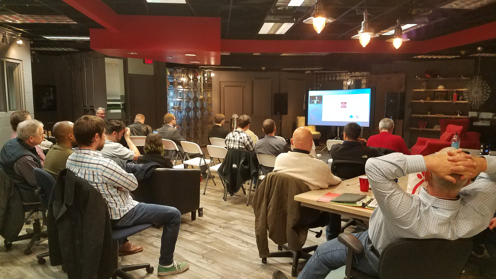
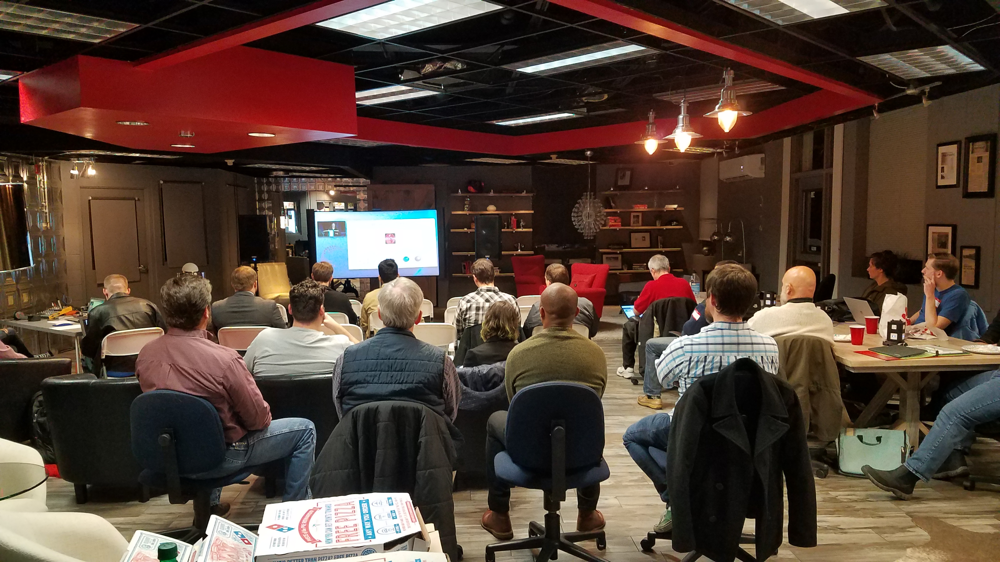
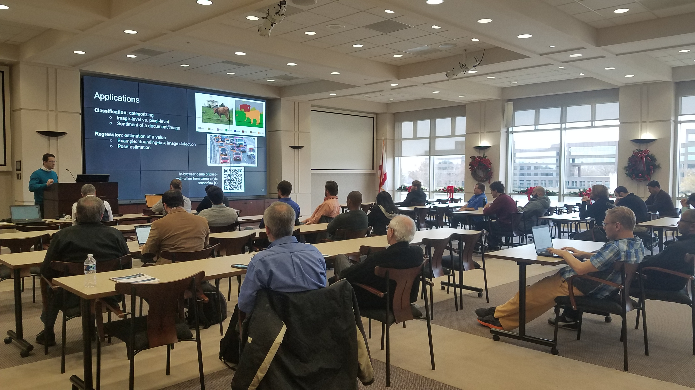

+++
title =  "NeurIPS 2019"
date = 2019-12-11T22:40:19-05:00
tags = []
featured_image = ""
description = ""
+++

Huntsville AI was selected to host a remote NeurIPS meetup to coincide with the global NeurIPS conference in Vancouer Canada. The remote meetup consisted of a Wednesday night 3 hour session to close out Huntsville AI for 2019 and another 2 hour session held at Adtran on Thursday.

Both sessions were well attended, and a lot of good conversations and connections were made!

<!--more-->

## Wednesday Night

Here are some of the photos from the Wednesday night session at [HuntsvilleWest](https://www.huntsvillewest.com/) for [CoWorking Night](https://coworkingnight.org/). 

Pizza and drinks were provided by [CohesionForce, Inc](http://www.cohesionforce.com/).

## Thursday Lunch

For the Thursday session, we held our first joint meetup with the Adtran Tech Team. Many thanks to Shane Stookey and May Chen for helping to coordinate!

Again, pizza and drinks were provided by [CohesionForce, Inc](http://www.cohesionforce.com/).

Overall, it was the best event of the year! We could not have done it without the help of Chuck, who provided the graphics and AV for both sessions. 

## Here's to more of this in 2020!
