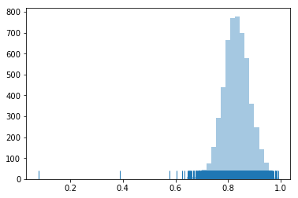
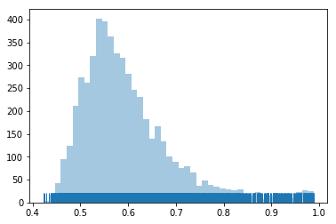
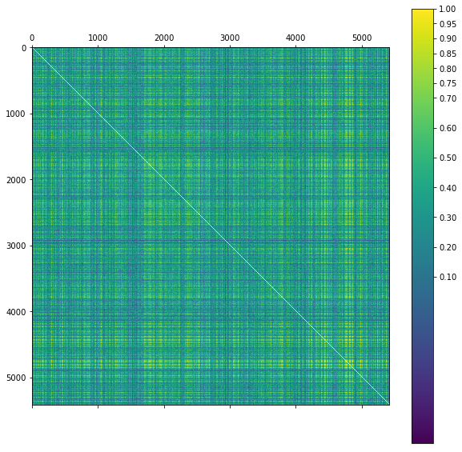
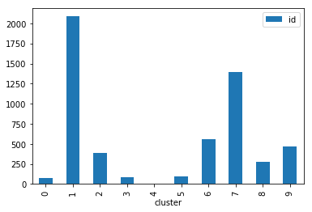
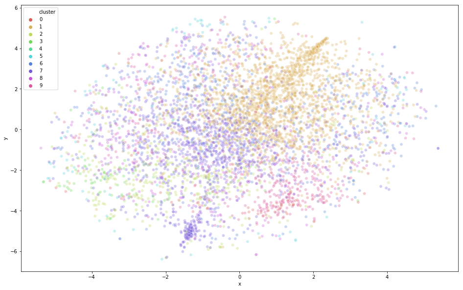
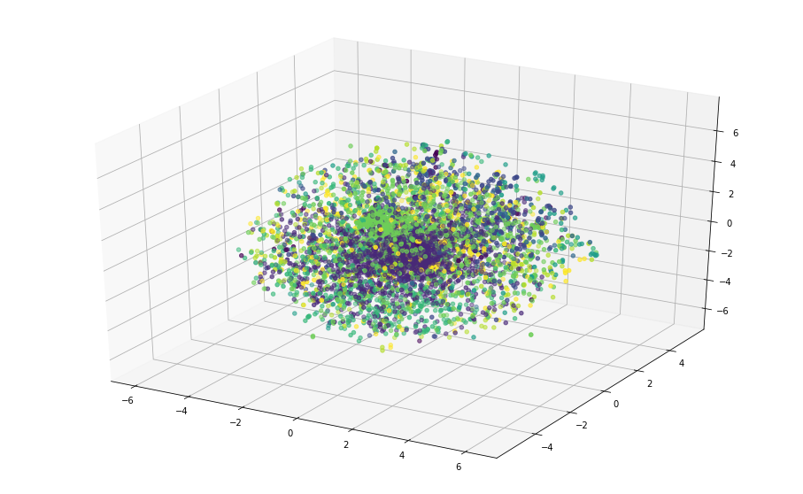
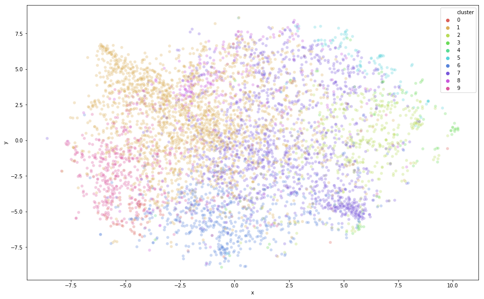
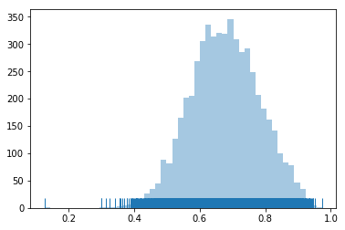
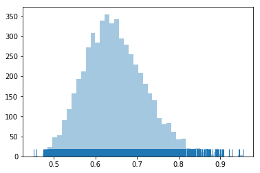

+++
title =  "Doc2Vec Update"
date = 2020-07-29T22:40:19-05:00
tags = []
featured_image = ""
description = ""
+++

This notebook is a demonstration of using Doc2Vec as an approach to compare the text of bug reports from an open source Bugzilla project. The Doc2Vec model from gensim is based on the word2vec paper but includes an additional input that identifies the document in the input.

<!--more-->


<center><h1>Bug Comparison with Doc2Vec</h1></center>

Personal opinion is that the API is difficult to understand with little tutorial material avaialble for how to implement this model in a practical solution.

API doc [here](https://radimrehurek.com/gensim/models/doc2vec.html)

Based on the paper [Distributed Representations of Sentences and Documents](https://arxiv.org/pdf/1405.4053v2.pdf) by Quoc Le and Tomas Mikolov.


# Experiments

1. stop words vs no stop words

2. Try different instantiations of the Doc2Vec

3. Try training pre-trained wikipedia version


```python
#Global Imports
import re
import pandas as pd
import numpy as np
import matplotlib.pyplot as plt
import seaborn as sns
import random
import spacy
import gensim
import collections
import statistics
```

# Loading Bugzilla Data

The data for this notebook was put together from the Eclipse XText project Bugzilla. You can find a link [here](https://bugs.eclipse.org/bugs/buglist.cgi?component=Xtext&product=TMF)

The bugs and associated comments were loaded into a pandas dataframe and stored in parquet format.


```python
url = 'https://github.com/HSV-AI/bug-analysis/raw/master/data/df-xtext.parquet.gzip'
df = pd.read_parquet(url)
```

# Creating a Tokenize Method

The tokenize method is used by the Doc2Vec model to extract a list of words from a document. This method can have major impacts on the performance of the model based on how it is configured. There are different approaches for TF-IDF that drop out many of the words that do not work for the Doc2Vec approach where the order of the words matters.

Other things that work well with probabilistic approaches like capturing the lemma of the word instead of the actual word may actually reduce the accuracy of the Doc2Vec model.


```python
text = """    java.lang.ClassCastException: HIDDEN
    at org.eclipse.xtext.xbase.ui.debug.XbaseBreakpointDetailPaneFactory.getDetailPaneTypes(XbaseBreakpointDetailPaneFactory.java:42)
    at org.eclipse.debug.internal.ui.views.variables.details.DetailPaneManager$DetailPaneFactoryExtension.getDetailPaneTypes(DetailPaneManager.java:94)
    at org.eclipse.debug.internal.ui.views.variables.details.DetailPaneManager.getPossiblePaneIDs(DetailPaneManager.java:385)
    at org.eclipse.debug.internal.ui.views.variables.details.DetailPaneManager.getPreferredPaneFromSelection(DetailPaneManager.java:285)
    at org.eclipse.debug.internal.ui.views.variables.details.DetailPaneProxy.display(DetailPaneProxy.java:109)
    at org.eclipse.jdt.internal.debug.ui.ExpressionInformationControlCreator$ExpressionInformationControl$2.updateComplete(ExpressionInformationControlCreator.java:344)
    at org.eclipse.debug.internal.ui.viewers.model.TreeModelContentProvider$4.run(TreeModelContentProvider.java:751)
    at org.eclipse.core.runtime.SafeRunner.run(SafeRunner.java:42)
    at org.eclipse.debug.internal.ui.viewers.model.TreeModelContentProvider.notifyUpdate(TreeModelContentProvider.java:737)
    at org.eclipse.debug.internal.ui.viewers.model.TreeModelContentProvider.updatesComplete(TreeModelContentProvider.java:653)
    at org.eclipse.debug.internal.ui.viewers.model.TreeModelContentProvider.performUpdates(TreeModelContentProvider.java:1747)
    at org.eclipse.debug.internal.ui.viewers.model.TreeModelContentProvider.access$10(TreeModelContentProvider.java:1723)
    at org.eclipse.debug.internal.ui.viewers.model.TreeModelContentProvider$6.run(TreeModelContentProvider.java:1703)
    at org.eclipse.swt.widgets.RunnableLock.run(RunnableLock.java:35)
    at org.eclipse.swt.widgets.Synchronizer.runAsyncMessages(Synchronizer.java:136)
    at org.eclipse.swt.widgets.Display.runAsyncMessages(Display.java:4147)
    at org.eclipse.swt.widgets.Display.readAndDispatch(Display.java:3764)
    at org.eclipse.e4.ui.internal.workbench.swt.PartRenderingEngine$9.run(PartRenderingEngine.java:1151)
    at org.eclipse.core.databinding.observable.Realm.runWithDefault(Realm.java:337)
    at org.eclipse.e4.ui.internal.workbench.swt.PartRenderingEngine.run(PartRenderingEngine.java:1032)
    at org.eclipse.e4.ui.internal.workbench.E4Workbench.createAndRunUI(E4Workbench.java:156)
    at org.eclipse.ui.internal.Workbench$5.run(Workbench.java:648)
    at org.eclipse.core.databinding.observable.Realm.runWithDefault(Realm.java:337)
    at org.eclipse.ui.internal.Workbench.createAndRunWorkbench(Workbench.java:592)
    at org.eclipse.ui.PlatformUI.createAndRunWorkbench(PlatformUI.java:150)
    at org.eclipse.ui.internal.ide.application.IDEApplication.start(IDEApplication.java:138)
    at org.eclipse.equinox.internal.app.EclipseAppHandle.run(EclipseAppHandle.java:196)
    at org.eclipse.core.runtime.internal.adaptor.EclipseAppLauncher.runApplication(EclipseAppLauncher.java:134)
    at org.eclipse.core.runtime.internal.adaptor.EclipseAppLauncher.start(EclipseAppLauncher.java:104)
    at org.eclipse.core.runtime.adaptor.EclipseStarter.run(EclipseStarter.java:380)
    at org.eclipse.core.runtime.adaptor.EclipseStarter.run(EclipseStarter.java:235)
    at sun.reflect.NativeMethodAccessorImpl.invoke0(null:-2)
    at sun.reflect.NativeMethodAccessorImpl.invoke(null:-1)
    at sun.reflect.DelegatingMethodAccessorImpl.invoke(null:-1)
    at java.lang.reflect.Method.invoke(null:-1)
    at org.eclipse.equinox.launcher.Main.invokeFramework(Main.java:648)
    at org.eclipse.equinox.launcher.Main.basicRun(Main.java:603)
    at org.eclipse.equinox.launcher.Main.run(Main.java:1465)"""

exception_regex = re.compile(r"(?m)^.*?Exception.*(?:[\r\n]+^\s*at .*)+", re.MULTILINE | re.IGNORECASE)
exception_regex.sub("", text)
```


    ''


```python
nlp = spacy.load("en_core_web_sm")

exception_regex = re.compile(r".+Exception[^\n].*\s+at", re.MULTILINE | re.IGNORECASE)
greater_regex = re.compile(r"^> .*$", re.MULTILINE | re.IGNORECASE)
gerrit_created_regex = re.compile(r"New Gerrit change created: [^\ ]+", re.MULTILINE | re.IGNORECASE)
gerrit_merge_regex = re.compile(r"Gerrit change [^\s]+ was merged to [^\.]+\.", re.MULTILINE | re.IGNORECASE)
gerrit_commit_regex = re.compile(r"Commit: [^\ ]+", re.MULTILINE | re.IGNORECASE)

filter = ['VERB', 'NOUN', 'PROPN']

def tokenize_spacy(text):
    text = greater_regex.sub("", text)
    text = exception_regex.sub("", text)
    text = gerrit_created_regex.sub("", text)
    text = gerrit_merge_regex.sub("", text)
    text = gerrit_commit_regex.sub("", text)
    filtered_tokens = []
    
    doc = nlp(text)
    for sent in doc.sents:
        for token in sent:
#            if re.fullmatch('[a-zA-Z]+', token.text) and not token.is_stop:
#            if token.pos_ in filter and re.fullmatch('[a-zA-Z]+', token.text):
            if re.fullmatch('[a-zA-Z]+', token.text):
#                 filtered_tokens.append(token.lemma_)
                filtered_tokens.append(token.text)
    return filtered_tokens

```

# TaggedDocument

The Word2Vec model uses an array of TaggedDocuments as input for training. The TaggedDocument consists of an array of words/tokens (from our tokenizer) and a list of tags. In our case, the tags used only includes the ID of the bug.


```python
def read_corpus():
  for i, row in df.iterrows():
    yield gensim.models.doc2vec.TaggedDocument(tokenize_spacy(row['text']), [row['id']])

train_corpus = list(read_corpus())
```

Let's take a look at a random TaggedDocument in the corpus. This is a good check to see what the tokenizer is providing based on the text of the bug.


```python
doc_id = random.randint(0, len(train_corpus) - 1)
doc = train_corpus[doc_id]
tag = doc.tags[0]
print(tag,doc.words)
text = df.iloc[doc_id]['text']
print('\n',text)
```

    363914 ['Check', 'that', 'you', 'can', 'not', 'append', 'a', 'null', 'segment', 'to', 'a', 'QualifiedName', 'Build', 'Identifier', 'Just', 'a', 'minor', 'enhancement', 'The', 'factory', 'checks', 'that', 'you', 'can', 'not', 'create', 'a', 'qualified', 'name', 'with', 'a', 'null', 'segment', 'However', 'the', 'function', 'does', 'not', 'Would', 'be', 'better', 'to', 'always', 'guarantee', 'the', 'non', 'null', 'invariant', 'and', 'also', 'check', 'the', 'parameter', 'of', 'the', 'append', 'operation', 'Reproducible', 'Always', 'fixed', 'pushed', 'to', 'master', 'We', 'have', 'to', 'make', 'sure', 'that', 'no', 'client', 'code', 'in', 'the', 'frameworks', 'passes', 'null', 'to', 'As', 'as', 'discussed', 'internally', 'I', 'removed', 'the', 'null', 'check', 'for', 'now', 'since', 'it', 'might', 'lead', 'to', 'new', 'exceptions', 'in', 'clients', 'The', 'plan', 'is', 'to', 'apply', 'the', 'apply', 'the', 'null', 'check', 'again', 'right', 'after', 'we', 'have', 'release', 'Xtext', 'This', 'will', 'allow', 'us', 'to', 'do', 'more', 'thorough', 'testing', 'The', 'commit', 'can', 'be', 're', 'applied', 'via', 'git', 'cherry', 'pick', 'cherry', 'picked', 'and', 'pushed', 'Requested', 'via', 'bug', 'Requested', 'via', 'bug']
    
     Check that you cannot append a null segment to a QualifiedName  Build Identifier: 20110916-0149
    
    Just a minor enhancement.  The factory org.eclipse.xtext.naming.QualifiedName.create(String...) checks that you cannot create a qualified name with a "null" segment.  However, the org.eclipse.xtext.naming.QualifiedName.append(String) function does not.  Would be better to always guarantee the non-null invariant and also check the parameter of the append operation.
    
    Reproducible: Always fixed; pushed to 'master'. We have to make sure that no client code in the frameworks passes null to QualifiedName#append As as discussed internally, I've removed the null-check for now since it might lead to new exceptions in clients. 
    
    The plan is to apply the apply the null-check again right after we have release Xtext 2.2. This will allow us to do more thorough testing. 
    
    The commit can be re-applied via "git cherry-pick -x b74a06f705a9a0750289e2152d49941f4727e756" cherry-picked and pushed. Requested via bug 522520.
    
    -M. Requested via bug 522520.
    
    -M.


# Doc2Vec Model

Believe it or not, there are 22 available parameters for use in the constructor with 21 being optional. The API also does not list the defaults for the optional parameters.

The required parameter is the vector of tagged documents to use for training.

The best way to figure this out is to use

```??gensim.models.doc2vec.Doc2Vec()```

in a notebook cell.

Copying the text of the method headers gives us:

    Doc2Vec(documents=None, dm_mean=None, dm=1, dbow_words=0, dm_concat=0, dm_tag_count=1, docvecs=None, docvecs_mapfile=None, comment=None, trim_rule=None, callbacks=(), **kwargs)

    BaseWordEmbeddingsModel(sentences=None, workers=3, vector_size=100, epochs=5, callbacks=(), batch_words=10000, trim_rule=None, sg=0, alpha=0.025, window=5, seed=1, hs=0, negative=5, cbow_mean=1, min_alpha=0.0001, compute_loss=False, fast_version=0, **kwargs)


dm ({1,0}, optional) – Defines the training algorithm. 

If dm=1, ‘distributed memory’ (PV-DM) is used. Otherwise, distributed bag of words (PV-DBOW) is employed.

This is similar to the skip-gram method vs DBOW method for word vectors.

The Distributed Memory version takes the order of the words into account when categorizing the document vectors, so we will use that version.

## Building Vocabulary

The first step in setting up the model is to build the vocabulary using the list of tagged documents.

    model.build_vocab(documents, update=False, progress_per=10000, keep_raw_vocab=False, trim_rule=None, **kwargs)

## Training the model

The final step is training the model.

     model.train(documents, total_examples=None, total_words=None, epochs=None, start_alpha=None, end_alpha=None, word_count=0, queue_factor=2, report_delay=1.0, callbacks=())


```python
model = gensim.models.doc2vec.Doc2Vec(min_count=2, epochs=40)
%time model.build_vocab(train_corpus)
%time model.train(train_corpus, total_examples=model.corpus_count, epochs=model.epochs)

```

    CPU times: user 5.68 s, sys: 56.1 ms, total: 5.73 s
    Wall time: 5.27 s
    CPU times: user 1min 7s, sys: 655 ms, total: 1min 8s
    Wall time: 26.9 s


```python
model.save('bugzilla.doc2vec')

??model.save()
```

# Using the Doc2Vec Model

The easiest way to use the model is with the *most_similar* method. This method will return a list of the most similar tagged documents based on the label passed into the method. For our use, we pass in the ID of the bug that we want to find a similar bug for.

    model.docvecs.most_similar(positive=None, negative=None, topn=10, clip_start=0, clip_end=None, indexer=None)


```python
model.docvecs.most_similar(231773)
```


    [(348199, 0.6316051483154297),
     (287550, 0.6027359962463379),
     (266427, 0.588177502155304),
     (287071, 0.5791216492652893),
     (266426, 0.576055109500885),
     (362787, 0.5739638805389404),
     (366414, 0.5676364898681641),
     (288103, 0.5655356645584106),
     (298734, 0.5629502534866333),
     (457006, 0.5558722019195557)]


The previous method only works from a previously known (and trained) label from a tagged document. The other way to use the model is find the most similar tagged document based on a list of words. In order to do this:

1. Get a list of words from a new document
2. **Important!** Tokenize this list of words using the same tokenizer used when creating the corpus
3. Convert the list of tokens to a vector using the **infer_vector** method
4. Call the **most_similar** method with the new vector


```python
from scipy import spatial

text1 = df.iloc[0,:]['text']
text2 = tokenize_spacy(text1)
vector = model.infer_vector(text2)

similar = model.docvecs.most_similar([vector])
print(similar)

```

    [(231773, 0.8523540496826172), (266426, 0.6661572456359863), (287550, 0.6446412801742554), (476754, 0.6223310828208923), (266427, 0.6220518350601196), (312276, 0.6161692142486572), (473712, 0.613205075263977), (348199, 0.6111923456192017), (402990, 0.6109021902084351), (529006, 0.6108258366584778)]


# Evaluating the Doc2Vec Model

Of course, it is helpful that our model returned the ID of the document that we vectorized and passed into the most_similar method. If this model is to be useful, each document in the corpus should be similar to itself. Using a cosine similarity metric, we can calculate the self-similarity of each document.

We'll calculate the self-similarity below and graph the distribution to see what we have.


```python
similarities = []
for doc_id in range(len(train_corpus)):
    learned_vector = model.docvecs[train_corpus[doc_id].tags[0]]
    inferred_vector = model.infer_vector(train_corpus[doc_id].words)
    distance = 1 - spatial.distance.cosine(learned_vector, inferred_vector)
    similarities.append(distance)
    
sns.distplot(similarities, kde=False, rug=True)
```

    /opt/tools/anaconda/lib/python3.6/site-packages/scipy/stats/stats.py:1713: FutureWarning: Using a non-tuple sequence for multidimensional indexing is deprecated; use `arr[tuple(seq)]` instead of `arr[seq]`. In the future this will be interpreted as an array index, `arr[np.array(seq)]`, which will result either in an error or a different result.
      return np.add.reduce(sorted[indexer] * weights, axis=axis) / sumval


    <matplotlib.axes._subplots.AxesSubplot at 0x7fc20167fd30>





# Check Outliers

Let's look at any items that are not self similar based on the model.


```python
print(min(similarities))
index = similarities.index(min(similarities))
print(df.iloc[index,:])
```

    0.0787610188126564
    component                       Website
    date          2013-07-16 07:03:42+00:00
    id                               413031
    product                             TMF
    reporter        dixit.pawan@hotmail.com
    resolution                   WORKSFORME
    status                           CLOSED
    text                  fgbnghjm  cvbndfh
    title                          fgbnghjm
    year                               2013
    month                            2013-7
    day                          2013-07-16
    Name: 3581, dtype: object


Given that the text consists of "fgbnghjm  cvbndfh", you can see why this bug is not handled well by the model.

We can also look at the distribution of the next similar document probabililties.


```python
next_similar = []
for doc_id in range(len(train_corpus)):
    sims = model.docvecs.most_similar(train_corpus[doc_id].tags[0])
    next_similar.append(sims[0][1])
    
sns.distplot(next_similar, kde=False, rug=True)

print(statistics.mean(next_similar))
print(statistics.stdev(next_similar))
```

    /opt/tools/anaconda/lib/python3.6/site-packages/scipy/stats/stats.py:1713: FutureWarning: Using a non-tuple sequence for multidimensional indexing is deprecated; use `arr[tuple(seq)]` instead of `arr[seq]`. In the future this will be interpreted as an array index, `arr[np.array(seq)]`, which will result either in an error or a different result.
      return np.add.reduce(sorted[indexer] * weights, axis=axis) / sumval


    0.600508476063155
    0.10128021819227365





# Detecting Near Duplicates

Looking into the most similar bugs that have a very high probability (>98%), it appears that we have an issue with the tokenizer when it runs across a Java stack trace.


```python
print(max(next_similar))
index = next_similar.index(max(next_similar))
bug_id = df.iloc[index,:]['id']
print(bug_id,df.iloc[index,:]['text'])

print('\n\n')

sims = model.docvecs.most_similar(bug_id)
text = df.loc[df['id'] == sims[1][0]].iloc[0]['text']
print(sims[1][0],text)


```

    0.9883251190185547
    461367 CCE in XbaseBreakpointDetailPaneFactory.getDetailPaneTypes (42)  The following incident was reported via the automated error reporting:
    
    
        code:                   120
        plugin:                 org.eclipse.debug.ui_3.11.0.v20150116-1131
        message:                HIDDEN
        fingerprint:            a8a83b9f
        exception class:        java.lang.ClassCastException
        exception message:      HIDDEN
        number of children:     0
        
        java.lang.ClassCastException: HIDDEN
        at org.eclipse.xtext.xbase.ui.debug.XbaseBreakpointDetailPaneFactory.getDetailPaneTypes(XbaseBreakpointDetailPaneFactory.java:42)
        at org.eclipse.debug.internal.ui.views.variables.details.DetailPaneManager$DetailPaneFactoryExtension.getDetailPaneTypes(DetailPaneManager.java:94)
        at org.eclipse.debug.internal.ui.views.variables.details.DetailPaneManager.getPossiblePaneIDs(DetailPaneManager.java:385)
        at org.eclipse.debug.internal.ui.views.variables.details.DetailPaneManager.getPreferredPaneFromSelection(DetailPaneManager.java:285)
        at org.eclipse.debug.internal.ui.views.variables.details.DetailPaneProxy.display(DetailPaneProxy.java:109)
        at org.eclipse.jdt.internal.debug.ui.ExpressionInformationControlCreator$ExpressionInformationControl$2.updateComplete(ExpressionInformationControlCreator.java:344)
        at org.eclipse.debug.internal.ui.viewers.model.TreeModelContentProvider$4.run(TreeModelContentProvider.java:751)
        at org.eclipse.core.runtime.SafeRunner.run(SafeRunner.java:42)
        at org.eclipse.debug.internal.ui.viewers.model.TreeModelContentProvider.notifyUpdate(TreeModelContentProvider.java:737)
        at org.eclipse.debug.internal.ui.viewers.model.TreeModelContentProvider.updatesComplete(TreeModelContentProvider.java:653)
        at org.eclipse.debug.internal.ui.viewers.model.TreeModelContentProvider.performUpdates(TreeModelContentProvider.java:1747)
        at org.eclipse.debug.internal.ui.viewers.model.TreeModelContentProvider.access$10(TreeModelContentProvider.java:1723)
        at org.eclipse.debug.internal.ui.viewers.model.TreeModelContentProvider$6.run(TreeModelContentProvider.java:1703)
        at org.eclipse.swt.widgets.RunnableLock.run(RunnableLock.java:35)
        at org.eclipse.swt.widgets.Synchronizer.runAsyncMessages(Synchronizer.java:136)
        at org.eclipse.swt.widgets.Display.runAsyncMessages(Display.java:4147)
        at org.eclipse.swt.widgets.Display.readAndDispatch(Display.java:3764)
        at org.eclipse.e4.ui.internal.workbench.swt.PartRenderingEngine$9.run(PartRenderingEngine.java:1151)
        at org.eclipse.core.databinding.observable.Realm.runWithDefault(Realm.java:337)
        at org.eclipse.e4.ui.internal.workbench.swt.PartRenderingEngine.run(PartRenderingEngine.java:1032)
        at org.eclipse.e4.ui.internal.workbench.E4Workbench.createAndRunUI(E4Workbench.java:156)
        at org.eclipse.ui.internal.Workbench$5.run(Workbench.java:648)
        at org.eclipse.core.databinding.observable.Realm.runWithDefault(Realm.java:337)
        at org.eclipse.ui.internal.Workbench.createAndRunWorkbench(Workbench.java:592)
        at org.eclipse.ui.PlatformUI.createAndRunWorkbench(PlatformUI.java:150)
        at org.eclipse.ui.internal.ide.application.IDEApplication.start(IDEApplication.java:138)
        at org.eclipse.equinox.internal.app.EclipseAppHandle.run(EclipseAppHandle.java:196)
        at org.eclipse.core.runtime.internal.adaptor.EclipseAppLauncher.runApplication(EclipseAppLauncher.java:134)
        at org.eclipse.core.runtime.internal.adaptor.EclipseAppLauncher.start(EclipseAppLauncher.java:104)
        at org.eclipse.core.runtime.adaptor.EclipseStarter.run(EclipseStarter.java:380)
        at org.eclipse.core.runtime.adaptor.EclipseStarter.run(EclipseStarter.java:235)
        at sun.reflect.NativeMethodAccessorImpl.invoke0(null:-2)
        at sun.reflect.NativeMethodAccessorImpl.invoke(null:-1)
        at sun.reflect.DelegatingMethodAccessorImpl.invoke(null:-1)
        at java.lang.reflect.Method.invoke(null:-1)
        at org.eclipse.equinox.launcher.Main.invokeFramework(Main.java:648)
        at org.eclipse.equinox.launcher.Main.basicRun(Main.java:603)
        at org.eclipse.equinox.launcher.Main.run(Main.java:1465)
       
      
    
    General Information:
    
        reported-by:      Serhii Belei
        anonymous-id:     648982dc-0aba-4421-a13b-c3f08b2cb5aa
        eclipse-build-id: 4.5.0.I20150203-1300
        eclipse-product:  org.eclipse.epp.package.jee.product
        operating system: Windows7 6.1.0 (x86_64) - win32
        jre-version:      1.8.0_25-b18
    
    The following plug-ins were present on the execution stack (*):
        1. org.eclipse.core.databinding.observable_1.4.1.v20140910-2107
        2. org.eclipse.core.databinding_1.4.100.v20141002-1314
        3. org.eclipse.core.runtime_3.10.0.v20150112-1422
        4. org.eclipse.debug.ui_3.11.0.v20150116-1131
        5. org.eclipse.e4.ui.workbench_1.3.0.v20150113-2327
        6. org.eclipse.e4.ui.workbench.swt_0.12.100.v20150114-0905
        7. org.eclipse.equinox.app_1.3.200.v20130910-1609
        8. org.eclipse.equinox.launcher_1.3.0.v20140415-2008
        9. org.eclipse.jdt.debug.ui_3.6.400.v20150123-1739
        10. org.eclipse.jdt.debug_3.8.200.v20150116-1130
        11. org.eclipse.jdt_3.11.0.v20150203-1300
        12. org.eclipse.swt_3.104.0.v20150203-2243
        13. org.eclipse.ui_3.107.0.v20150107-0903
        14. org.eclipse.ui.ide.application_1.0.600.v20150120-1542
        15. org.eclipse.ui.ide_3.10.100.v20150126-1117
        16. org.eclipse.xtext.xbase.ui_2.7.2.v201409160908
        17. org.eclipse.xtext.xbase_2.7.2.v201409160908
        18. org.eclipse.xtext_2.8.0.v201502030924
    
    Please note that:
    * Messages, stacktraces, and nested status objects may be shortened.
    * Bug fields like status, resolution, and whiteboard are sent
      back to reporters.
    * The list of present bundles and their respective versions was
      calculated by package naming heuristics. This may or may not reflect reality.
    
    Other Resources:
    * Report: https://dev.eclipse.org/recommenders/committers/confess/#/problems/54f58a02e4b03058b001ee0f  
    * Manual: https://dev.eclipse.org/recommenders/community/confess/#/guide
    
    
    Thank you for your assistance.
    Your friendly error-reports-inbox.
    
    
    
    463383 JME in JavaElement.newNotPresentException (556)  The following incident was reported via the automated error reporting:
    
    
        code:                   0
        plugin:                 org.apache.log4j_1.2.15.v201012070815
        message:                HIDDEN
        fingerprint:            f72b76f8
        exception class:        org.eclipse.emf.common.util.WrappedException
        exception message:      HIDDEN
        number of children:     0
        
        org.eclipse.emf.common.util.WrappedException: HIDDEN
        at org.eclipse.xtext.util.Exceptions.throwUncheckedException(Exceptions.java:26)
        at org.eclipse.xtext.validation.AbstractDeclarativeValidator$MethodWrapper.handleInvocationTargetException(AbstractDeclarativeValidator.java:137)
        at org.eclipse.xtext.validation.AbstractDeclarativeValidator$MethodWrapper.invoke(AbstractDeclarativeValidator.java:125)
        at org.eclipse.xtext.validation.AbstractDeclarativeValidator.internalValidate(AbstractDeclarativeValidator.java:312)
        at org.eclipse.xtext.validation.AbstractInjectableValidator.validate(AbstractInjectableValidator.java:69)
        at org.eclipse.xtext.validation.CompositeEValidator.validate(CompositeEValidator.java:153)
        at org.eclipse.emf.ecore.util.Diagnostician.doValidate(Diagnostician.java:171)
        at org.eclipse.emf.ecore.util.Diagnostician.validate(Diagnostician.java:158)
        at org.eclipse.emf.ecore.util.Diagnostician.validate(Diagnostician.java:137)
        at org.eclipse.xtext.validation.CancelableDiagnostician.validate(CancelableDiagnostician.java:37)
        at org.eclipse.emf.ecore.util.Diagnostician.doValidateContents(Diagnostician.java:181)
        at org.eclipse.xtext.validation.CancelableDiagnostician.doValidateContents(CancelableDiagnostician.java:49)
        at org.eclipse.xtext.xbase.validation.XbaseDiagnostician.doValidateContents(XbaseDiagnostician.java:47)
        at org.eclipse.emf.ecore.util.Diagnostician.validate(Diagnostician.java:161)
        at org.eclipse.emf.ecore.util.Diagnostician.validate(Diagnostician.java:137)
        at org.eclipse.xtext.validation.CancelableDiagnostician.validate(CancelableDiagnostician.java:37)
        at org.eclipse.emf.ecore.util.Diagnostician.doValidateContents(Diagnostician.java:181)
        at org.eclipse.xtext.validation.CancelableDiagnostician.doValidateContents(CancelableDiagnostician.java:49)
        at org.eclipse.xtext.xbase.validation.XbaseDiagnostician.doValidateContents(XbaseDiagnostician.java:47)
        at org.eclipse.emf.ecore.util.Diagnostician.validate(Diagnostician.java:161)
        at org.eclipse.emf.ecore.util.Diagnostician.validate(Diagnostician.java:137)
        at org.eclipse.xtext.validation.CancelableDiagnostician.validate(CancelableDiagnostician.java:37)
        at org.eclipse.emf.ecore.util.Diagnostician.doValidateContents(Diagnostician.java:185)
        at org.eclipse.xtext.validation.CancelableDiagnostician.doValidateContents(CancelableDiagnostician.java:49)
        at org.eclipse.xtext.xbase.validation.XbaseDiagnostician.doValidateContents(XbaseDiagnostician.java:47)
        at org.eclipse.emf.ecore.util.Diagnostician.validate(Diagnostician.java:161)
        at org.eclipse.emf.ecore.util.Diagnostician.validate(Diagnostician.java:137)
        at org.eclipse.xtext.validation.CancelableDiagnostician.validate(CancelableDiagnostician.java:37)
        at org.eclipse.emf.ecore.util.Diagnostician.validate(Diagnostician.java:120)
        at org.eclipse.xtext.validation.ResourceValidatorImpl.validate(ResourceValidatorImpl.java:148)
        at org.eclipse.xtext.xbase.annotations.validation.DerivedStateAwareResourceValidator.validate(DerivedStateAwareResourceValidator.java:33)
        at org.eclipse.xtext.validation.ResourceValidatorImpl.validate(ResourceValidatorImpl.java:91)
        at org.eclipse.xtend.core.validation.CachingResourceValidatorImpl.access$1(CachingResourceValidatorImpl.java:1)
        at org.eclipse.xtend.core.validation.CachingResourceValidatorImpl$1.get(CachingResourceValidatorImpl.java:78)
        at org.eclipse.xtend.core.validation.CachingResourceValidatorImpl$1.get(CachingResourceValidatorImpl.java:1)
        at org.eclipse.xtext.util.OnChangeEvictingCache.get(OnChangeEvictingCache.java:77)
        at org.eclipse.xtend.core.validation.CachingResourceValidatorImpl.validate(CachingResourceValidatorImpl.java:81)
        at org.eclipse.xtend.ide.validator.XtendResourceValidator.validate(XtendResourceValidator.java:33)
        at org.eclipse.xtext.ui.editor.validation.ValidationJob$1.exec(ValidationJob.java:91)
        at org.eclipse.xtext.ui.editor.validation.ValidationJob$1.exec(ValidationJob.java:1)
        at org.eclipse.xtext.util.concurrent.CancelableUnitOfWork.exec(CancelableUnitOfWork.java:26)
        at org.eclipse.xtext.resource.OutdatedStateManager.exec(OutdatedStateManager.java:121)
        at org.eclipse.xtext.ui.editor.model.XtextDocument$XtextDocumentLocker.internalReadOnly(XtextDocument.java:512)
        at org.eclipse.xtext.ui.editor.model.XtextDocument$XtextDocumentLocker.readOnly(XtextDocument.java:484)
        at org.eclipse.xtext.ui.editor.model.XtextDocument.readOnly(XtextDocument.java:133)
        at org.eclipse.xtext.ui.editor.validation.ValidationJob.createIssues(ValidationJob.java:86)
        at org.eclipse.xtext.ui.editor.validation.ValidationJob.run(ValidationJob.java:67)
        at org.eclipse.core.internal.jobs.Worker.run(Worker.java:55)
    caused by: org.eclipse.jdt.core.JavaModelException: HIDDEN
        at org.eclipse.jdt.internal.core.JavaElement.newNotPresentException(JavaElement.java:556)
        at org.eclipse.jdt.internal.core.Openable.getUnderlyingResource(Openable.java:344)
        at org.eclipse.jdt.internal.core.CompilationUnit.getUnderlyingResource(CompilationUnit.java:930)
        at org.eclipse.jdt.internal.core.SourceRefElement.getUnderlyingResource(SourceRefElement.java:226)
        at org.eclipse.xtend.ide.validator.XtendUIValidator.isSameProject(XtendUIValidator.java:85)
        at org.eclipse.xtend.ide.validator.XtendUIValidator.checkAnnotationInSameProject(XtendUIValidator.java:72)
        at sun.reflect.GeneratedMethodAccessor171.invoke(null:-1)
        at sun.reflect.DelegatingMethodAccessorImpl.invoke(DelegatingMethodAccessorImpl.java:43)
        at java.lang.reflect.Method.invoke(Method.java:483)
        at org.eclipse.xtext.validation.AbstractDeclarativeValidator$MethodWrapper.invoke(AbstractDeclarativeValidator.java:118)
        at org.eclipse.xtext.validation.AbstractDeclarativeValidator.internalValidate(AbstractDeclarativeValidator.java:312)
        at org.eclipse.xtext.validation.AbstractInjectableValidator.validate(AbstractInjectableValidator.java:69)
        at org.eclipse.xtext.validation.CompositeEValidator.validate(CompositeEValidator.java:153)
        at org.eclipse.emf.ecore.util.Diagnostician.doValidate(Diagnostician.java:171)
        at org.eclipse.emf.ecore.util.Diagnostician.validate(Diagnostician.java:158)
        at org.eclipse.emf.ecore.util.Diagnostician.validate(Diagnostician.java:137)
        at org.eclipse.xtext.validation.CancelableDiagnostician.validate(CancelableDiagnostician.java:37)
        at org.eclipse.emf.ecore.util.Diagnostician.doValidateContents(Diagnostician.java:181)
        at org.eclipse.xtext.validation.CancelableDiagnostician.doValidateContents(CancelableDiagnostician.java:49)
        at org.eclipse.xtext.xbase.validation.XbaseDiagnostician.doValidateContents(XbaseDiagnostician.java:47)
        at org.eclipse.emf.ecore.util.Diagnostician.validate(Diagnostician.java:161)
        at org.eclipse.emf.ecore.util.Diagnostician.validate(Diagnostician.java:137)
        at org.eclipse.xtext.validation.CancelableDiagnostician.validate(CancelableDiagnostician.java:37)
        at org.eclipse.emf.ecore.util.Diagnostician.doValidateContents(Diagnostician.java:181)
        at org.eclipse.xtext.validation.CancelableDiagnostician.doValidateContents(CancelableDiagnostician.java:49)
        at org.eclipse.xtext.xbase.validation.XbaseDiagnostician.doValidateContents(XbaseDiagnostician.java:47)
        at org.eclipse.emf.ecore.util.Diagnostician.validate(Diagnostician.java:161)
        at org.eclipse.emf.ecore.util.Diagnostician.validate(Diagnostician.java:137)
        at org.eclipse.xtext.validation.CancelableDiagnostician.validate(CancelableDiagnostician.java:37)
        at org.eclipse.emf.ecore.util.Diagnostician.doValidateContents(Diagnostician.java:185)
        at org.eclipse.xtext.validation.CancelableDiagnostician.doValidateContents(CancelableDiagnostician.java:49)
        at org.eclipse.xtext.xbase.validation.XbaseDiagnostician.doValidateContents(XbaseDiagnostician.java:47)
        at org.eclipse.emf.ecore.util.Diagnostician.validate(Diagnostician.java:161)
        at org.eclipse.emf.ecore.util.Diagnostician.validate(Diagnostician.java:137)
        at org.eclipse.xtext.validation.CancelableDiagnostician.validate(CancelableDiagnostician.java:37)
        at org.eclipse.emf.ecore.util.Diagnostician.validate(Diagnostician.java:120)
        at org.eclipse.xtext.validation.ResourceValidatorImpl.validate(ResourceValidatorImpl.java:148)
        at org.eclipse.xtext.xbase.annotations.validation.DerivedStateAwareResourceValidator.validate(DerivedStateAwareResourceValidator.java:33)
        at org.eclipse.xtext.validation.ResourceValidatorImpl.validate(ResourceValidatorImpl.java:91)
        at org.eclipse.xtend.core.validation.CachingResourceValidatorImpl.access$1(CachingResourceValidatorImpl.java:1)
        at org.eclipse.xtend.core.validation.CachingResourceValidatorImpl$1.get(CachingResourceValidatorImpl.java:78)
        at org.eclipse.xtend.core.validation.CachingResourceValidatorImpl$1.get(CachingResourceValidatorImpl.java:1)
        at org.eclipse.xtext.util.OnChangeEvictingCache.get(OnChangeEvictingCache.java:77)
        at org.eclipse.xtend.core.validation.CachingResourceValidatorImpl.validate(CachingResourceValidatorImpl.java:81)
        at org.eclipse.xtend.ide.validator.XtendResourceValidator.validate(XtendResourceValidator.java:33)
        at org.eclipse.xtext.ui.editor.validation.ValidationJob$1.exec(ValidationJob.java:91)
        at org.eclipse.xtext.ui.editor.validation.ValidationJob$1.exec(ValidationJob.java:1)
        at org.eclipse.xtext.util.concurrent.CancelableUnitOfWork.exec(CancelableUnitOfWork.java:26)
        at org.eclipse.xtext.resource.OutdatedStateManager.exec(OutdatedStateManager.java:121)
        at org.eclipse.xtext.ui.editor.model.XtextDocument$XtextDocumentLocker.internalReadOnly(XtextDocument.java:512)
        at org.eclipse.xtext.ui.editor.model.XtextDocument$XtextDocumentLocker.readOnly(XtextDocument.java:484)
        at org.eclipse.xtext.ui.editor.model.XtextDocument.readOnly(XtextDocument.java:133)
        at org.eclipse.xtext.ui.editor.validation.ValidationJob.createIssues(ValidationJob.java:86)
        at org.eclipse.xtext.ui.editor.validation.ValidationJob.run(ValidationJob.java:67)
        at org.eclipse.core.internal.jobs.Worker.run(Worker.java:55)
       
      
    
    General Information:
    
        reported-by:      Tobse
        anonymous-id:     ef35a7d7-0cbe-4995-a50b-ea7da1b26ef1
        eclipse-build-id: 4.5.0.I20150203-1300
        eclipse-product:  org.eclipse.epp.package.dsl.product
        operating system: Windows7 6.1.0 (x86_64) - win32
        jre-version:      1.8.0_25-b18
    
    The following plug-ins were present on the execution stack (*):
        1. org.eclipse.core.jobs_3.7.0.v20150115-2226
        2. org.eclipse.emf.ecore_2.11.0.v20150325-0930
        3. org.eclipse.emf_2.6.0.v20150325-0933
        4. org.eclipse.jdt.core_3.11.0.v20150126-2015
        5. org.eclipse.jdt_3.11.0.v20150203-1300
        6. org.eclipse.xtend.core_2.9.0.v201503270548
        7. org.eclipse.xtend_2.1.0.v201503260847
        8. org.eclipse.xtend.ide_2.9.0.v201503270548
        9. org.eclipse.xtext_2.9.0.v201503270548
        10. org.eclipse.xtext.ui_2.9.0.v201503270548
        11. org.eclipse.xtext.util_2.9.0.v201503270548
        12. org.eclipse.xtext.xbase_2.9.0.v201503270548
    
    Please note that:
    * Messages, stacktraces, and nested status objects may be shortened.
    * Bug fields like status, resolution, and whiteboard are sent
      back to reporters.
    * The list of present bundles and their respective versions was
      calculated by package naming heuristics. This may or may not reflect reality.
    
    Other Resources:
    * Report: https://dev.eclipse.org/recommenders/committers/confess/#/problems/55155bfde4b026254edfe60d  
    * Manual: https://dev.eclipse.org/recommenders/community/confess/#/guide
    
    
    Thank you for your assistance.
    Your friendly error-reports-inbox. PR: https://github.com/eclipse/xtext/pull/105 Reviewed commit
    https://github.com/eclipse/xtext/commit/5da237c2a4a57e4ca2da32dc28f5a3152c1f1eba


```python
from sklearn.metrics.pairwise import cosine_similarity

X = []
for doc_id in range(len(train_corpus)):
    inferred_vector = model.infer_vector(train_corpus[doc_id].words)
    X.append(inferred_vector)
    
matrix = cosine_similarity(X)
 
fig, ax = plt.subplots(figsize=(10,10))
cax = ax.matshow(matrix, interpolation='nearest')
fig.colorbar(cax, ticks=[0.1, 0.2, 0.3, 0.4, 0.5, 0.6, 0.7, .75,.8,.85,.90,.95,1])
plt.show()
```





# Finding Similar Bugs

Of course, the final test to see if this model will provide a useful return value is to do a random sample and then find the most similar bug.


```python
# Pick a random document from the test corpus and infer a vector from the model
doc_id = random.randint(0, len(train_corpus) - 1)
doc = train_corpus[doc_id]

text = df.loc[df['id'] == doc.tags[0]].iloc[0]['text']
print(doc.tags[0],text)

inferred_vector = model.infer_vector(doc.words)

sims = model.docvecs.most_similar([inferred_vector], topn=len(model.docvecs))

print("\n\nDocument that is",sims[1][1]," similar below\n\n")

text = df.loc[df['id'] == sims[1][0]].iloc[0]['text']
print(sims[1][0],text)

```

    288444 [validation] quickfixes for unresolved references  A common use case for quickfixes will be to create an object corresponding to an unresolved cross reference. In order for Xtext to support this use case the following changes should be made:
    
    1. The Xtext resource diagnostic interface (org.eclipse.xtext.diagnostics.Diagnostic) should provide some kind of getCode() method similar to what the TransformationDiagnostic implementation already has. Possibly it should also provide getters for the triggering AbstractNode, EObject, and StructuralFeature (allthough it should be possible to derive this from the offset and length) as this may be required to implement a corresponding quickfix.
    
    2. Using the resource diagnostic's code the IXtextResourceChecker (and ValidationJob) can produce an Eclipse marker having a corresponding code attribute set accordingly. This however also requires investigating the marker type to use for resource diagnostics.
    
    3. AbstractDeclarativeQuickfixProvider should also simplify the implementation of fixes for unresolved references. This would be difficult to achieve using the existing @Fix annotation because (a) the marker's code is fixed (unless my some other means overridden by the user) and (b) the type of object to create  cannot be declared (only that of the context object). A possibility would be to add another dedicated annotation. E.g.
    
      @FixReference(type=Bar.class, label="Create Bar '${name}'")
      public void createNewBar(Foo context, IMarker marker) {...} A currently possible workaround is for a subclass to override the AbstractDeclarativeQuickfixProvider behavior to:
    
    - use the marker's message to check whether it is an unresolved cross reference
    - derive the context object and reference (and thus also type of object to create) using the marker's offset and length *** Bug 283439 has been marked as a duplicate of this bug. *** Adding such quickfixed is possible with the new API. Please have a look at 
      org.eclipse.xtext.example.ui.quickfix.DomainmodelQuickfixProvider
    for an example. You also have to override
      org.eclipse.xtext.example.ui.linking.DomainmodelLinkingDiagnosticMessageProvider
    to return individual issue codes and issue data for different linking problems.
    
    Having worked out the example, I don't think we should offer more simplistic API for these kinds of quickfixes, as there are too many tweaking points
    
    - the EClass of the element to be created, which is not always the eReferenceType of the EReference. In the domainmodel it depends on the type of the container's container (Attribute or Reference)
    - attribute initialisation, partly extracted at linking time and provided by means of issue data
    - the eContainer for the new element, which is not necessarily the container of the referring element
    - formatting Closing bug which were set to RESOLVED before Eclipse Neon.0.
    
    
    Document that is 0.5803667306900024  similar below
    
    
    263793 [Editor] Add quick fix support  Created attachment 124816
    quick fix proof of concept
    
    The subject of this feature request is support for quick fixes (i.e. Ctrl+1) in the Xtext editor. In particular it should also be possible to implement quick fixes for user defined Check constraint violations.
    
    Terminology
    ===========
    Quick fix : A quick fix is the means of accessing in invoking a marker resolution (see extension point org.eclipse.ui.ide.markerResolution) in the editor using the Ctrl+1 keybinding (default).
    
    Marker resolution : A marker resolution is a runnable object (instance of IMarkerResolution) whose purpose is to solve the problem annotated by a particular marker. A marker resolution is created by a IMarkerResolutionGenerator registered using the extension point org.eclipse.ui.ide.markerResolution).
    
    Check constraint violation : By this we mean the event of a particular model object violating a given Check constraint. This violation will be represented by a marker in the Xtext editor.
    
    Implementation constraints
    ==========================
    The current Check language should not be modified.
    
    Proposed design and implementation
    ==================================
    The Xtext editor is already capable of displaying markers pertaining to the resource being edited. We now also want to be able to access any marker resolutions registered against the markers using the Ctrl+1 key binding (Quick Fix). This involves enhancing XtextSourceViewerConfiguration and implementing a custom QuickAssistAssistant (see patch). This part can IMHO safely be added.
    
    Additionally we want to be able to implement quick fixes for specific Check constraints. Here I propose that the Check constraint should not simply return an error message, but something structured (when the quick fix needs to be adviced). E.g.
    
    context Foo#name WARNING fooName() :
    	name != "FOO"
    ;
    
    With the following extensions (the second would be part of an Xtext library):
    
    fooName(Foo this) :
    	error("Don't use the name FOO", "illegalId").addAll({"foo", this})
    ;
    
    error(Object this, String message, String type) :
    	{"message", message, "type", type}
    ;
    
    The returned data is essentially a map represented as a list (due to oAW expression limitations). Given this list in Check a Diagnostic object will be created with corresponding data (Diagnostic#getData()). In XtextResourceChecker (and XtextDocument) these same properties will be set on the corresponding created Marker objects. If no list is returned by the check constraint the original behavior will be employed.
    
    The "message" (mapped to "message" attribute of marker) and "type" (mapped to markerType of marker!) properties are predefined but it is also important to note that the user has the ability to add any other custom properties which will automatically be attached to the Diagnostic and eventually the marker (as with "foo" in the example).
    
    The marker resolution generator can in turn use these marker attributes to decide if it can create a corresponding marker resolution (actually a lot of this filtering can already be done in the plugin.xml extension).
    
    Additionally the attributes could also represent hints for the actual marker resolution. For example: The Check constraint could set an "resolutionExpr" property to "setName('FOOBAR')" and a corresponding generic marker resolution generator (expecting this property to be set) could then evaluate the given expression when the quick fix is run.
    
    The attached patch implements this described design. Note that it's a proof of concept only!
    
    Alternatives
    ============
    The interface for passing data from the Check constraint to be associated with the corresponding Diagnostic could instead be implemented using a JAVA extension. In this case the Check constraint would just return a String (business as usual). E.g.
    
    context Foo#name WARNING fooName() :
    	name != "FOO"
    ;
    
    String fooName(Foo this) :
    	error("Don't use the name FOO", "illegalId")
    ;
    
    String error(Object this, String message, String type) :
    	internalError(message, type) -> message
    ;
    
    private internalError(Object this, String message, String type) :
    	JAVA org.eclipse.xtext...
    ;
    
    The mechanism for making this data available to the marker resolution generators could also be a dedicated Java API (instead of attaching the data to the marker directly). But this way there is not the possibility of filtering using the <attribute/> element in plugin.xml. Created attachment 126171
    quick assist assistant patch
    
    If you agree I'd like to propose the attached patch to enable the Xtext editor to run any available marker resolutions enabled for the displayed markers. Actually there is already an action XtextMarkerRulerAction to support this, but the required QuickAssistAssistant implementation was still missing.
    
    I think the API outlined in the description (for integration of Check etc.) requires some more thinking. This is something I'm working on. But what's in the patch is a necessary first step. Created attachment 140346
    simple quickfix generator fragment
    
    The attachment demonstrates a simplistic quickfix generator fragment complete with the supporting changes to the Xtext editor.
    
    As demonstrated in the Domainmodel example a fix can then be declared by a method like this:
    
        @Fix(code = DomainmodelJavaValidator.CAPITAL_TYPE_NAME, label = "Capitalize name", description = "Capitalize name of type")
        public void fixNameCase(Type type, IMarker marker) {
            type.setName(type.getName().toUpperCase());
        }
    
    The "code" attribute matches up against a corresponding Java check:
    
        @Check
        public void checkTypeNameStartsWithCapital(Type type) {
            if (!Character.isUpperCase(type.getName().charAt(0))) {
                warning("Name should start with a capital", DomainmodelPackage.TYPE__NAME, CAPITAL_TYPE_NAME);
            }
        } +1 for this RFE. This would be great! Are there any plans about the target milestone? (In reply to comment #3)
    > +1 for this RFE. This would be great! Are there any plans about the target
    > milestone?
    > 
    
    No not yet, we'll update the property accordingly as soon as we have concrete plans. I also like it very much.
    Shouldn't we allow a list of codes per diagnostic? There might be multiple alternative ways to fix an issue. 
    In AbstractDeclarativeMarkerResolutionGenerator you pass the context EObject out of the read transaction in order to pass it into a modify transaction later. This could cause problems in cases where another write operation has changed or removed that object. I think the context object should be obtained within the modify transaction. 
    Some tests would be very nice. :-) (In reply to comment #5)
    > I also like it very much.
    > Shouldn't we allow a list of codes per diagnostic? There might be multiple
    > alternative ways to fix an issue. 
    
    The code simply identifies the problem, so one code per diagnostic should be enough. But we would then like to associate multiple fixes with the problem. Using a declarative approach we would want all @Fix annotated methods referring to that code to match. Thus something similar to the AbstractDeclarativeValidator.
    
    In my patch I use the PolymorphicDispatcher, but I've come to realize that this doesn't make sense here, as we want to match multiple methods, just like the AbstractDeclarativeValidator.
    
    The declarative base class supports @Fix annotated methods where the fix details (label, description, and icon) are in the annotation parameters and the method body simply represents the fix implementation. E.g.
    
    @Fix(code = 42, label = "Capitalize name", description = "Capitalize name of type")
    public void fixSomething(Foo foo, IMarker marker) {
       return ...;
    }
    
    In addition we may also want to allow a method to return the IMarkerResolution object describing the fix. This would allow for more conditional logic. E.g.
    
    @Fix(code=42)
    public IMarkerResolution fixSomething(Foo foo, IMarker marker) {
       return ...;
    }
    
    Any thoughts on this?
    
    > In AbstractDeclarativeMarkerResolutionGenerator you pass the context EObject
    > out of the read transaction in order to pass it into a modify transaction
    > later. This could cause problems in cases where another write operation has
    > changed or removed that object. I think the context object should be obtained
    > within the modify transaction. 
    > Some tests would be very nice. :-)
    > 
    
    I agree. (In reply to comment #6)
    > (In reply to comment #5)
    > > I also like it very much.
    > > Shouldn't we allow a list of codes per diagnostic? There might be multiple
    > > alternative ways to fix an issue. 
    > 
    > The code simply identifies the problem, so one code per diagnostic should be
    > enough. But we would then like to associate multiple fixes with the problem.
    > Using a declarative approach we would want all @Fix annotated methods referring
    > to that code to match. Thus something similar to the
    > AbstractDeclarativeValidator.
    > 
    > In my patch I use the PolymorphicDispatcher, but I've come to realize that this
    > doesn't make sense here, as we want to match multiple methods, just like the
    > AbstractDeclarativeValidator.
    > 
    > The declarative base class supports @Fix annotated methods where the fix
    > details (label, description, and icon) are in the annotation parameters and the
    > method body simply represents the fix implementation. E.g.
    > 
    > @Fix(code = 42, label = "Capitalize name", description = "Capitalize name of
    > type")
    > public void fixSomething(Foo foo, IMarker marker) {
    >    return ...;
    > }
    > 
    > In addition we may also want to allow a method to return the IMarkerResolution
    > object describing the fix. This would allow for more conditional logic. E.g.
    > 
    > @Fix(code=42)
    > public IMarkerResolution fixSomething(Foo foo, IMarker marker) {
    >    return ...;
    > }
    > 
    > Any thoughts on this?
    > 
    
    Sounds reasonable. I thought that the id identifies a fix not a problem.
    Of course what you described makes much more sense. :-)
     Fixed in CVS HEAD. > > In addition we may also want to allow a method to return the IMarkerResolution
    > > object describing the fix. This would allow for more conditional logic. E.g.
    > > 
    > > @Fix(code=42)
    > > public IMarkerResolution fixSomething(Foo foo, IMarker marker) {
    > >    return ...;
    > > }
    > > 
    > > Any thoughts on this?
    > > 
    > 
    > Sounds reasonable.
    
    As I couldn't yet find a concrete use case for this I decided to wait with this enhancement. We can always file a new bug later on.
    
    Also note that the documentation hasn't been written yet. I reopen this so we don't forget the documentation. Thanks Knut :-) Closing all bugs that were set to RESOLVED before Neon.0 Closing all bugs that were set to RESOLVED before Neon.0


# Clustering the Embedding Space

We can use KMeans to divide the embeddings into clusters based on cosine similarity.


```python
from sklearn import cluster
from sklearn import metrics
kmeans = cluster.KMeans(n_clusters=10)
kmeans.fit(X)

```


    KMeans(algorithm='auto', copy_x=True, init='k-means++', max_iter=300,
        n_clusters=10, n_init=10, n_jobs=None, precompute_distances='auto',
        random_state=None, tol=0.0001, verbose=0)


```python
print(kmeans.cluster_centers_.shape)
print(kmeans.labels_.shape)
print(kmeans.labels_)

clusters = kmeans.labels_.tolist()
df['cluster'] = clusters
# print(train_corpus)
# l = kmeans.fit_predict(model.docvecs.vectors_docs)
```

    (10, 100)
    (5415,)
    [9 1 1 ... 6 7 2]


```python
labels = kmeans.labels_
print(kmeans.labels_)

bugs = { 'id': df.loc[:,'id'], 'cluster': clusters }
frame = pd.DataFrame(bugs)
temp = frame.loc[:,['id','cluster']].groupby('cluster').count().plot.bar()
plt.show()
```

    [9 1 1 ... 6 7 2]





# Visualizing the Embedding Space

To visualize the space of the embedding, we will use TSNE to reduce from 100 to 2 dimensions.


```python
# Creating and fitting the tsne model to the document embeddings
from MulticoreTSNE import MulticoreTSNE as TSNE
tsne_model = TSNE(n_jobs=4,
                  early_exaggeration=4,
                  n_components=2,
                  verbose=1,
                  random_state=2018,
                  n_iter=300)
tsne_d2v = tsne_model.fit_transform(np.array(X))

```


```python
df['x'] = tsne_d2v[:,0]
df['y'] = tsne_d2v[:,1]
plt.figure(figsize=(16,10))
sns.scatterplot(x='x', y='y', hue="cluster", palette=sns.color_palette("hls", 10), legend="full", alpha=0.3, data=df)
```


    <matplotlib.axes._subplots.AxesSubplot at 0x7fc1f22e84a8>





Now how about doing it in 3D?


```python
tsne_model = TSNE(n_jobs=4,
                  early_exaggeration=4,
                  n_components=3,
                  verbose=1,
                  random_state=2018,
                  n_iter=300)
tsne_d2v = tsne_model.fit_transform(np.array(X))

```


```python
from mpl_toolkits.mplot3d import Axes3D

df['x'] = tsne_d2v[:,0]
df['y'] = tsne_d2v[:,1]
df['z'] = tsne_d2v[:,2]

ax = plt.figure(figsize=(16,10)).gca(projection='3d')
ax.scatter( xs=df.loc[:,"x"], ys=df.loc[:,"y"], zs=df.loc[:,"z"], c=df.loc[:,"cluster"])
plt.show()
```





Another method that I've seen used is to use PCA to perform an initial reduction in dimension and then TSNE to get the dimensions down to 2.


```python
from sklearn.decomposition import PCA

pca_20 = PCA(n_components=20)
pca_result_20 = pca_20.fit_transform(X)
```


```python
tsne_d2v = tsne_model.fit_transform(np.array(pca_result_20))
df['x'] = tsne_d2v[:,0]
df['y'] = tsne_d2v[:,1]
plt.figure(figsize=(16,10))
sns.scatterplot( x='x', y='y', hue="cluster", palette=sns.color_palette("hls", 10), legend="full", alpha=0.3, data=df )
```


    <matplotlib.axes._subplots.AxesSubplot at 0x7fc1f1b525f8>





# Transfer Learning

Now that we have some idea of what we're working with, let's see if transfer learning is an option with Doc2Vec. To do this, we'll start with a distributed memory Doc2Vec model that was trained on the WikiPedia corpus. Then we will further train the model on our bug corpus and see what the results are.


```python
from gensim.models.doc2vec import Doc2Vec
loadedModel = Doc2Vec.load('PV-DBOW.doc2vec')
print(loadedModel.corpus_count)
```

    4841417


```python
%time loadedModel.train(train_corpus, total_examples=model.corpus_count, epochs=20)

```

    CPU times: user 6min 47s, sys: 1.91 s, total: 6min 49s
    Wall time: 1min 3s


```python
similarities = []
for doc_id in range(len(train_corpus)):
    learned_vector = loadedModel.docvecs[train_corpus[doc_id].tags[0]]
    inferred_vector = loadedModel.infer_vector(train_corpus[doc_id].words)
    distance = 1 - spatial.distance.cosine(learned_vector, inferred_vector)
    similarities.append(distance)
    
sns.distplot(similarities, kde=False, rug=True)
```

    /opt/tools/anaconda/lib/python3.6/site-packages/scipy/stats/stats.py:1713: FutureWarning: Using a non-tuple sequence for multidimensional indexing is deprecated; use `arr[tuple(seq)]` instead of `arr[seq]`. In the future this will be interpreted as an array index, `arr[np.array(seq)]`, which will result either in an error or a different result.
      return np.add.reduce(sorted[indexer] * weights, axis=axis) / sumval


    <matplotlib.axes._subplots.AxesSubplot at 0x7fc18fb6beb8>





```python
next_similar = []
for doc_id in range(len(train_corpus)):
    sims = loadedModel.docvecs.most_similar(train_corpus[doc_id].tags[0])
    next_similar.append(sims[0][1])
    
sns.distplot(next_similar, kde=False, rug=True)
```

    /opt/tools/anaconda/lib/python3.6/site-packages/scipy/stats/stats.py:1713: FutureWarning: Using a non-tuple sequence for multidimensional indexing is deprecated; use `arr[tuple(seq)]` instead of `arr[seq]`. In the future this will be interpreted as an array index, `arr[np.array(seq)]`, which will result either in an error or a different result.
      return np.add.reduce(sorted[indexer] * weights, axis=axis) / sumval


    <matplotlib.axes._subplots.AxesSubplot at 0x7fc17b6532e8>





```python
import statistics

print(statistics.mean(next_similar))
print(statistics.stdev(next_similar))
```

    0.6487272019641661
    0.0749555443609924

